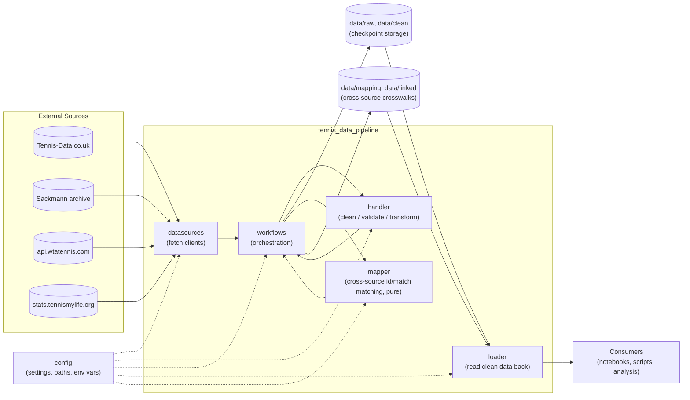
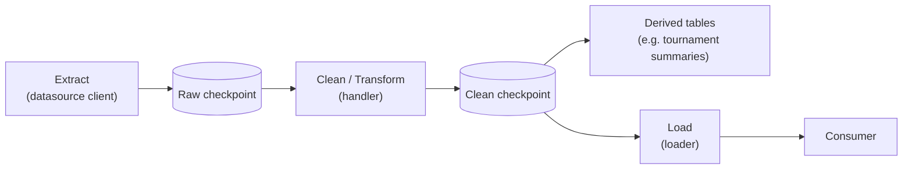

# Architecture

This document is the entry point for the architecture of
`tennis_data_pipeline`: what the system does, how its major components
relate to each other, and how data moves through it. It stays at a high
level and links out to a dedicated page per subpackage for implementation
detail — see [Major Components](#major-components).

This is architecture documentation, not user documentation or API
reference. For what the repository is and its data licensing, see the
[root README](../../README.md). For per-data-source implementation detail
(concrete module/function call chains), see each source's own docs — e.g.
[Tennis-Data.co.uk: data flow](../data-sources/tennis-data-uk/data-flow.md).

## System Overview

- **Primary purpose:** fetch tennis match data from third-party sources,
  clean/normalize it into a canonical schema, and persist it as versionable
  checkpoints for downstream analysis.
- **Major users/consumers:** notebooks and scripts in this repository that
  read the clean checkpoints via `loader` (analysis, exploration).
  > TODO: Confirm whether any external/downstream consumers exist outside
  > this repository.
- **Major inputs:** third-party tennis data providers. Currently
  implemented end-to-end (fetch/live-load through a persisted
  tournament-summary table): [Tennis-Data.co.uk](http://www.tennis-data.co.uk/alldata.php)
  (full match-level raw/clean checkpoints), the Sackmann archive (live
  match-level access, no local checkpoint — see
  [sackmann-fetch.md](../pipelines/sackmann-fetch.md)), and the WTA
  tournaments API (`api.wtatennis.com`, WTA-only, tournament-level data
  only — see [wta-api-fetch.md](../pipelines/wta-api-fetch.md)). Client
  only, no further integration: stats.tennismylife.org. See
  [datasources.md](datasources.md).
- **Major outputs:** raw and clean CSV checkpoints under `data/raw/` and
  `data/clean/`, derived tournament-summary tables and data-quality
  reports, plus (via `mapper`/`workflows.mapper`) a cross-source
  tournament-id crosswalk and per-year UK↔Sackmann match-level linkage
  tables under `data/mapping/` and `data/linked/` — see
  [tournament-matching.md](../pipelines/tournament-matching.md) and
  [match-linking.md](../pipelines/match-linking.md).

## Architectural Principles

The following principles are visible in the current code. Treat this list
as a starting point, not a settled decision — add, remove, or reword
entries as the project's actual intent is confirmed.

- **Separation of concerns:** fetching (`datasources`), cleaning
  (`handler`), orchestration/persistence (`workflows`), read-back
  (`loader`), and cross-source matching (`mapper`, pure — no I/O) are
  separate subpackages with a one-directional dependency chain.
- **Reproducibility / idempotency:** the raw checkpoint stage means
  re-cleaning never requires re-downloading, and re-downloading a given
  year overwrites deterministically rather than accumulating history. The
  cross-source mapping/linkage CSVs are upsert-based for the same reason.
- **Data lineage:** cleaned rows carry `source`, `tour`,
  `source_event_key`, and `source_match_key` columns tracing them back to
  the original file; cross-source outputs carry `official_tournament_id`,
  `match_method`, and candidate-count/agreement columns tracing a link
  back to the evidence that produced it.
- **Configuration over hard-coded behavior:** paths, filenames, timeouts,
  and retry behavior are all read from `config` (file + env vars) rather
  than hard-coded in `datasources`/`handler`/`workflows`/`mapper`.
- **Never let an automatic rerun silently undo a human correction:** every
  upsert-based output in this repo (UK/Sackmann/WTA-API tournament tables,
  the tournament-id crosswalk, source-links, match-link overrides) has an
  explicit, documented precedence rule for what wins when a fresh run
  disagrees with what's already on disk — see each pipeline doc's
  "Persistence" section for the specifics, since the rule genuinely
  differs by file.
- **Testability:** `handler`'s cleaning/validation logic, every
  `datasources` client's checkpoint logic, and all of `mapper` are pure
  functions over `DataFrame`s/simple inputs, with unit tests under
  `tests/`.

> TODO: Confirm whether modularity, maintainability, or other principles
> not listed above should be documented explicitly.

## High-Level Architecture

Rename, remove, or add boxes as the system's actual shape changes — e.g. if
a source gets its own storage backend, or a new layer (an API, a
scheduler) is introduced.

## Major Components

| Component | Responsibility | Detail |
|---|---|---|
| `config` | Loads/validates settings from YAML + env vars; resolves data paths | [config.md](config.md) |
| `datasources` | Source-specific clients that fetch raw data, unmodified, from external providers | [datasources.md](datasources.md) |
| `handler` | Cleans, validates, and transforms raw data into the canonical schema | [handler.md](handler.md) |
| `workflows` | Orchestrates fetch → clean → checkpoint → tournament-table into callable pipelines per source | [workflows.md](workflows.md) |
| `loader` | Reads clean checkpoints and cross-source mapping/linkage CSVs back into memory with correct dtypes | [loader.md](loader.md) |
| `mapper` | Pure (no I/O) cross-source matching logic: tournament-id crosswalk building, UK↔Sackmann match-level linking | [mapper.md](mapper.md) |

## Data Flow

At a high level, data for any source should move through these stages.
Document each source's *actual* call chain (module and function names) in
that source's own doc rather than here — see
[Tennis-Data.co.uk: data flow](../data-sources/tennis-data-uk/data-flow.md)
for a worked example.

Tennis-Data.co.uk has the full raw-checkpoint → clean-checkpoint →
tournament-table flow of this shape. Sackmann and the WTA tournaments API
reach the tournament-table stage too, but without a persisted raw/clean
match-level checkpoint (Sackmann has no checkpoint at all; the WTA API has
a raw checkpoint per the [fetch pipeline](../pipelines/wta-api-fetch.md) but
its tournament table is built by re-fetching live, not by reading that
checkpoint back) — see [datasources.md](datasources.md) for the current
status of each source. On top of this per-source flow, `mapper` +
`workflows.mapper` consume multiple sources' tournament/match tables
together to build the cross-source id crosswalk and match-level linkage —
see [tournament-matching.md](../pipelines/tournament-matching.md) and
[match-linking.md](../pipelines/match-linking.md).

## Repository Structure

| Path | Responsibility |
|---|---|
| `src/tennis_data_pipeline/config/` | Application configuration loading and schema. |
| `src/tennis_data_pipeline/datasources/` | External-provider clients (one subpackage per provider: `tennis_data_uk/`, `sackmann/`, `wta/`, `tennis_is_my_life/`). |
| `src/tennis_data_pipeline/handler/` | Cleaning/validation/transform logic (`uk/` — full match-level pipeline; `sackmann/` and `wta_api/` — tournament-table builders only). |
| `src/tennis_data_pipeline/workflows/` | End-to-end orchestration per source (`uk/`, `sackmann/`, `wta_api/`), plus `mapper/` for cross-source tournament/match matching. |
| `src/tennis_data_pipeline/loader/` | Read-back of clean checkpoints (`uk.py`) and cross-source mapping/linkage tables (`mapper.py`, `linked.py`). |
| `src/tennis_data_pipeline/mapper/` | Pure (no I/O) cross-source matching logic: `tournaments.py` (id crosswalk) and `matches/uk_sackmann/` (match-level linking). |
| `data/raw/` | Stage-2 raw checkpoints (source's original schema). |
| `data/clean/` | Stage-4 clean checkpoints (canonical schema) and derived tables/reports. |
| `data/mapping/` | Cross-source tournament-id crosswalk, source links, and hand-maintained manual-override CSVs. |
| `data/linked/` | Per-tour/year UK↔Sackmann match-level linkage outputs and rollup summaries. |
| `data/archive/` | Superseded/one-off historical snapshots, kept for reference. |
| `scripts/` | Thin CLI entry points around `workflows` (e.g. scheduled refresh). |
| `notebooks/` | Exploratory analysis and one-off data-cleaning notebooks. |
| `tests/` | Unit tests, mirroring the `src/` package layout. |
| `docs/` | Documentation: this `architecture/` folder, plus per-pipeline docs under `docs/pipelines/`, per-data-source docs under `docs/data-sources/`, and a CLI reference under `docs/scripts/`. |

## External Dependencies

| Dependency | Role |
|---|---|
| [Tennis-Data.co.uk](http://www.tennis-data.co.uk/alldata.php) | Upstream data source (implemented, full match-level pipeline). |
| Sackmann tennis archive (GitHub mirror) | Upstream data source (implemented; live match-level access + tournament-table builder, no local match-level checkpoint). |
| WTA tournaments API (`api.wtatennis.com`) | Upstream data source (implemented; WTA-only, tournament-level data — the authoritative `official_tournament_id` source for cross-source matching). |
| stats.tennismylife.org | Upstream data source (client only, not integrated further). |
| `requests` + `urllib3` retry adapters | Architecturally relevant at every datasource client boundary (timeouts/retries are a deliberate, configurable behavior, not incidental). |
| `pandas` | The in-memory data structure passed between every layer (`datasources` → `handler` → `workflows` → `loader`/`mapper`). |
| `pydantic` / `pydantic-settings` | Backs the `config` component's validation. |

> TODO: List any other externally-important libraries or platforms (e.g.
> a future database, object store, or scheduler) as they're introduced.

## Configuration

Configuration is loaded from `configs/config.yaml` with environment-variable
overrides (`${VAR}` / `${VAR:default}` syntax), resolved by `config/loader.py`.
See [config.md](config.md) for the loading mechanism, and `configs/config.yaml`
itself for the current set of options (paths, logging, API defaults,
per-source settings).

- **Environment variables:** override individual config values (e.g.
  `TENNIS_DATA_PIPELINE_RAW_DIR`, `LOG_LEVEL`, `TENNIS_DATA_UK_*`). See
  `configs/config.yaml` for the full list currently in use.
- **Configuration files:** `configs/config.yaml` (default); path overridable
  via `TENNIS_DATA_PIPELINE_CONFIG`.
- **Runtime parameters:** function-level arguments (e.g. `tour`, `year`,
  explicit `raw_dir`/`clean_dir` overrides) take precedence over config
  defaults where supported.
- **Secrets:** none identified in the current config schema (no API keys,
  tokens, or credentials).
  > TODO: Confirm whether any current or planned data source requires
  > authentication, and if so, document how secrets are supplied (env var
  > vs. secret store) separately from ordinary configuration.

## Error Handling and Reliability

- **Retries:** HTTP clients (`datasources.tennis_data_uk.client`,
  `datasources.sackmann.client`, `datasources.wta.client`) use
  `urllib3.util.Retry` via a `requests` `HTTPAdapter`, configured from
  `config`.
- **Validation:** `handler` raises on structural inconsistencies (reused
  tournament IDs, attribute mismatches within one tournament) rather than
  silently producing bad rows.
- **Known-issue handling:** one-off, hand-verified data corrections are
  tracked in an explicit registry (`handler/uk/cleaner/known_fixes/`)
  rather than ad hoc conditionals; each fix asserts it still matches
  exactly one row. The cross-source `mapper` pipelines have their own,
  analogous hand-maintained override mechanism (`manual_matches` /
  `manual_links` CSVs — see [tournament-matching.md](../pipelines/tournament-matching.md)
  and [match-linking.md](../pipelines/match-linking.md)).
- **Partial failure / unattended runs:** `workflows.uk.update.update_current_season()`
  treats each tour/year independently — a download failure is logged as a
  recoverable warning (self-heals next scheduled run), while a clean
  failure is logged as an error and fails the run (it usually means a new
  data-quality issue needs a fix added to `known_fixes`). The `mapper`
  scripts (`build_tournament_mapping.py`, `link_matches_uk_sackmann.py`)
  follow the same per-year skip-with-warning convention on a missing
  input, rather than aborting a multi-year batch.
- **Recovery behavior:** the raw checkpoint stage means a cleaning bug fix
  can be replayed against previously-downloaded data without needing
  network access again. The mapping/linked CSVs are upsert-based and
  never overwritten wholesale, so a rerun (or a hand correction) only
  touches the rows it actually recomputes.

> TODO: Document logging configuration/conventions in more depth, and note
> any gaps (e.g. no alerting/monitoring currently exists) if relevant.

## Testing Strategy

- **Unit tests:** `tests/handler/uk/cleaner/` (common helpers, known
  fixes, quality reporting, schema parity between ATP/WTA, tournament
  aggregation), `tests/sources/tennis_data_uk/` (client, checkpoint),
  `tests/sources/sackmann/` (client, cleaning, ATP/WTA tour helpers),
  `tests/sources/wta/` (WTA-API client, flattening), `tests/mapper/`
  (tournament-matching and match-linking logic, the most comprehensively
  tested area of the cross-source pipeline), `tests/workflows/mapper/`
  and `tests/loader/` (orchestration/persistence and typed-reload layers).
- **Integration tests:** none identified currently.
  > TODO: Confirm whether an end-to-end (network or fixture-driven)
  > integration test is planned for the full fetch → clean → load chain.
- **End-to-end tests:** none identified currently.
- **Data quality tests:** covered indirectly via `handler`'s structural
  validation and the `known_fixes` registry (each fix is tested to still
  match exactly one row).
- **Regression tests:** `tests/handler/uk/cleaner/test_schema_parity.py`
  guards against ATP/WTA schema drift.

## Design Decisions

Use this section for decisions not already captured elsewhere. The
Tennis-Data UK pipeline's key design decisions (raw/clean checkpoint
split, canonical schema, known-fix registry format) are already documented
in [docs/data-sources/tennis-data-uk/pipeline-plan.md](../data-sources/tennis-data-uk/pipeline-plan.md)
and are not duplicated here — link to it rather than copying it.

### Decision: [Decision Name]

**Context**

Why the decision was necessary.

**Decision**

What was chosen.

**Alternatives Considered**

What alternatives were evaluated.

**Rationale**

Why this option was selected.

**Tradeoffs**

What disadvantages or limitations this introduces.

## Known Limitations

- **Only Tennis-Data.co.uk has a full match-level raw → clean checkpoint
  pipeline.** Sackmann's match-level data is fetched live on every call
  with no local checkpoint at all (see
  [sackmann-fetch.md](../pipelines/sackmann-fetch.md#known-limitations--current-state));
  the WTA tournaments API has a raw checkpoint but its tournament table is
  built by re-fetching live rather than reading that checkpoint back (see
  [wta-api-tournaments.md](../pipelines/wta-api-tournaments.md#1-input-fetched-live-every-run)).
  Tennis Is My Life is client-only with no further integration.
- **`handler`/`workflows` are source-specific packages of very different
  depth**, not a uniform "one package per source" shape: `uk/` is the only
  one with a full clean/validate/known-fixes pipeline; `sackmann/` and
  `wta_api/` only build a tournament-summary table (match-level cleaning
  for Sackmann still lives in `datasources.sackmann.cleaning`, not
  `handler`). `loader` similarly only restores dtypes for the UK clean
  schema (`loader/uk.py`) and the `mapper`-produced crosswalk/linkage
  tables (`loader/mapper.py`, `loader/linked.py`) — there's no dtype-typed
  reload for Sackmann or WTA-API data. `loader/tournaments.py` exists as an
  empty placeholder module (docstring only, not imported anywhere).
- **The cross-source `mapper` pipelines only cover Tennis-Data UK and
  Sackmann** (tournament matching also folds in the WTA-tournaments-API as
  a backfill source for WTA). There's no ATP equivalent of the WTA
  tournaments API, and match-level linking doesn't yet cover a third
  source.

## Future Architecture

> TODO: Document likely next steps here as they're decided — e.g. giving
> Sackmann/WTA-API a real match-level raw/clean checkpoint, adding an ATP
> tournaments-API equivalent, extending match-level linking to a third
> source, adding integration tests, or introducing new storage/consumption
> layers.
