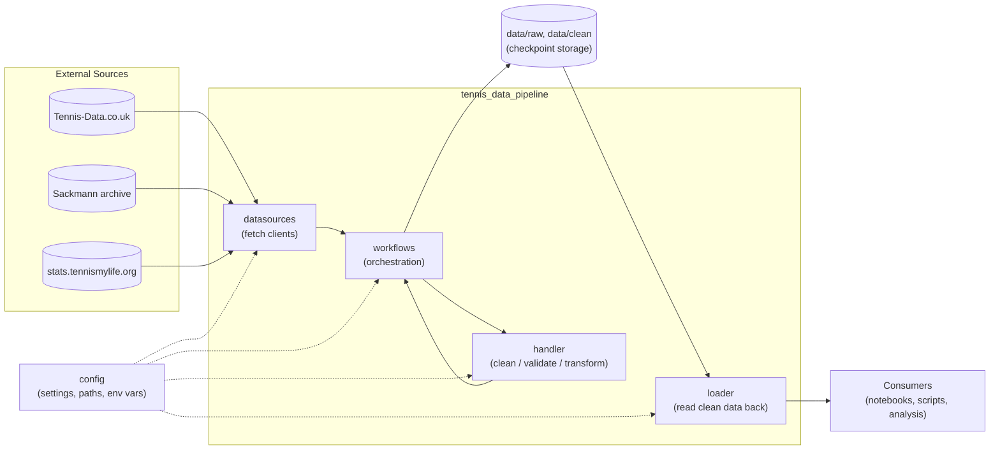
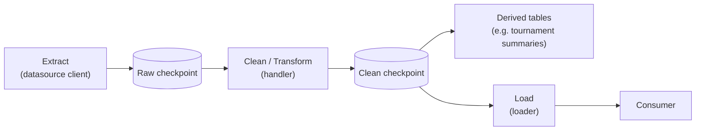

# Architecture

This document is the entry point for the architecture of
`tennis_data_pipeline`: what the system does, how its major components
relate to each other, and how data moves through it. It stays at a high
level and links out to a dedicated page per subpackage for implementation
detail — see [Major Components](#major-components).

This is architecture documentation, not user documentation or API
reference. For what the repository is and its data licensing, see the
[root README](../../README.md). For per-data-source implementation detail
(concrete module/function call chains), see each source's own docs — e.g.
[Tennis-Data.co.uk: data flow](../data-sources/tennis-data-uk/data-flow.md).

## System Overview

- **Primary purpose:** fetch tennis match data from third-party sources,
  clean/normalize it into a canonical schema, and persist it as versionable
  checkpoints for downstream analysis.
- **Major users/consumers:** notebooks and scripts in this repository that
  read the clean checkpoints via `loader` (analysis, exploration).
  > TODO: Confirm whether any external/downstream consumers exist outside
  > this repository.
- **Major inputs:** third-party tennis data providers. Currently
  implemented end-to-end: [Tennis-Data.co.uk](http://www.tennis-data.co.uk/alldata.php).
  Partially present: the Sackmann archive (client + standalone cleaning
  helpers, not yet wired into the shared pipeline) and
  stats.tennismylife.org (client only). See
  [datasources.md](datasources.md).
- **Major outputs:** raw and clean CSV checkpoints under `data/raw/` and
  `data/clean/`, plus derived tournament-summary tables and data-quality
  reports.

## Architectural Principles

The following principles are visible in the current code. Treat this list
as a starting point, not a settled decision — add, remove, or reword
entries as the project's actual intent is confirmed.

- **Separation of concerns:** fetching (`datasources`), cleaning
  (`handler`), orchestration/persistence (`workflows`), and read-back
  (`loader`) are separate subpackages with a one-directional dependency
  chain.
- **Reproducibility / idempotency:** the raw checkpoint stage means
  re-cleaning never requires re-downloading, and re-downloading a given
  year overwrites deterministically rather than accumulating history.
- **Data lineage:** cleaned rows carry `source`, `tour`,
  `source_event_key`, and `source_match_key` columns tracing them back to
  the original file.
- **Configuration over hard-coded behavior:** paths, filenames, timeouts,
  and retry behavior are all read from `config` (file + env vars) rather
  than hard-coded in `datasources`/`handler`/`workflows`.
- **Testability:** `handler`'s cleaning/validation logic and
  `datasources.tennis_data_uk`'s client/checkpoint logic are pure
  functions over `DataFrame`s/simple inputs, with unit tests under
  `tests/`.

> TODO: Confirm whether modularity, maintainability, or other principles
> not listed above should be documented explicitly.

## High-Level Architecture

Rename, remove, or add boxes as the system's actual shape changes — e.g. if
a source gets its own storage backend, or a new layer (an API, a
scheduler) is introduced.

## Major Components

| Component | Responsibility | Detail |
|---|---|---|
| `config` | Loads/validates settings from YAML + env vars; resolves data paths | [config.md](config.md) |
| `datasources` | Source-specific clients that fetch raw data, unmodified, from external providers | [datasources.md](datasources.md) |
| `handler` | Cleans, validates, and transforms raw data into the canonical schema | [handler.md](handler.md) |
| `workflows` | Orchestrates fetch → clean → checkpoint → tournament-table into callable pipelines per source | [workflows.md](workflows.md) |
| `loader` | Reads clean checkpoints back into memory with correct dtypes | [loader.md](loader.md) |

## Data Flow

At a high level, data for any source should move through these stages.
Document each source's *actual* call chain (module and function names) in
that source's own doc rather than here — see
[Tennis-Data.co.uk: data flow](../data-sources/tennis-data-uk/data-flow.md)
for a worked example.

Only Tennis-Data.co.uk currently has an implemented, end-to-end flow of
this shape.

## Repository Structure

| Path | Responsibility |
|---|---|
| `src/tennis_data_pipeline/config/` | Application configuration loading and schema. |
| `src/tennis_data_pipeline/datasources/` | External-provider clients (one subpackage per provider). |
| `src/tennis_data_pipeline/handler/` | Cleaning/validation/transform logic (currently: `uk/` only). |
| `src/tennis_data_pipeline/workflows/` | End-to-end orchestration per source (currently: `uk/` only). |
| `src/tennis_data_pipeline/loader/` | Read-back of clean checkpoints (currently: `uk.py` only). |
| `data/raw/` | Stage-2 raw checkpoints (source's original schema). |
| `data/clean/` | Stage-4 clean checkpoints (canonical schema) and derived tables/reports. |
| `data/archive/` | Superseded/one-off historical snapshots, kept for reference. |
| `scripts/` | Thin CLI entry points around `workflows` (e.g. scheduled refresh). |
| `notebooks/` | Exploratory analysis and one-off data-cleaning notebooks. |
| `tests/` | Unit tests, mirroring the `src/` package layout. |
| `docs/` | Documentation: this `architecture/` folder, plus per-data-source docs under `docs/data-sources/`. |

## External Dependencies

| Dependency | Role |
|---|---|
| [Tennis-Data.co.uk](http://www.tennis-data.co.uk/alldata.php) | Upstream data source (implemented). |
| Sackmann tennis archive (GitHub mirror) | Upstream data source (client implemented; not yet integrated end-to-end). |
| stats.tennismylife.org | Upstream data source (client only). |
| `requests` + `urllib3` retry adapters | Architecturally relevant at every datasource client boundary (timeouts/retries are a deliberate, configurable behavior, not incidental). |
| `pandas` | The in-memory data structure passed between every layer (`datasources` → `handler` → `workflows` → `loader`). |
| `pydantic` / `pydantic-settings` | Backs the `config` component's validation. |

> TODO: List any other externally-important libraries or platforms (e.g.
> a future database, object store, or scheduler) as they're introduced.

## Configuration

Configuration is loaded from `configs/config.yaml` with environment-variable
overrides (`${VAR}` / `${VAR:default}` syntax), resolved by `config/loader.py`.
See [config.md](config.md) for the loading mechanism, and `configs/config.yaml`
itself for the current set of options (paths, logging, API defaults,
per-source settings).

- **Environment variables:** override individual config values (e.g.
  `TENNIS_DATA_PIPELINE_RAW_DIR`, `LOG_LEVEL`, `TENNIS_DATA_UK_*`). See
  `configs/config.yaml` for the full list currently in use.
- **Configuration files:** `configs/config.yaml` (default); path overridable
  via `TENNIS_DATA_PIPELINE_CONFIG`.
- **Runtime parameters:** function-level arguments (e.g. `tour`, `year`,
  explicit `raw_dir`/`clean_dir` overrides) take precedence over config
  defaults where supported.
- **Secrets:** none identified in the current config schema (no API keys,
  tokens, or credentials).
  > TODO: Confirm whether any current or planned data source requires
  > authentication, and if so, document how secrets are supplied (env var
  > vs. secret store) separately from ordinary configuration.

## Error Handling and Reliability

- **Retries:** HTTP clients (`datasources.tennis_data_uk.client`) use
  `urllib3.util.Retry` via a `requests` `HTTPAdapter`, configured from
  `config`.
- **Validation:** `handler` raises on structural inconsistencies (reused
  tournament IDs, attribute mismatches within one tournament) rather than
  silently producing bad rows.
- **Known-issue handling:** one-off, hand-verified data corrections are
  tracked in an explicit registry (`handler/uk/cleaner/known_fixes/`)
  rather than ad hoc conditionals; each fix asserts it still matches
  exactly one row.
- **Partial failure / unattended runs:** `workflows.uk.update.update_current_season()`
  treats each tour/year independently — a download failure is logged as a
  recoverable warning (self-heals next scheduled run), while a clean
  failure is logged as an error and fails the run (it usually means a new
  data-quality issue needs a fix added to `known_fixes`).
- **Recovery behavior:** the raw checkpoint stage means a cleaning bug fix
  can be replayed against previously-downloaded data without needing
  network access again.

> TODO: Document logging configuration/conventions in more depth, and note
> any gaps (e.g. no alerting/monitoring currently exists) if relevant.

## Testing Strategy

- **Unit tests:** `tests/handler/uk/cleaner/` (common helpers, known
  fixes, quality reporting, schema parity between ATP/WTA, tournament
  aggregation) and `tests/sources/tennis_data_uk/` (client, checkpoint).
- **Integration tests:** none identified currently.
  > TODO: Confirm whether an end-to-end (network or fixture-driven)
  > integration test is planned for the full fetch → clean → load chain.
- **End-to-end tests:** none identified currently.
- **Data quality tests:** covered indirectly via `handler`'s structural
  validation and the `known_fixes` registry (each fix is tested to still
  match exactly one row).
- **Regression tests:** `tests/handler/uk/cleaner/test_schema_parity.py`
  guards against ATP/WTA schema drift.

## Design Decisions

Use this section for decisions not already captured elsewhere. The
Tennis-Data UK pipeline's key design decisions (raw/clean checkpoint
split, canonical schema, known-fix registry format) are already documented
in [docs/tennis-data-uk-pipeline-plan.md](../tennis-data-uk-pipeline-plan.md)
and are not duplicated here — link to it rather than copying it.

### Decision: [Decision Name]

**Context**

Why the decision was necessary.

**Decision**

What was chosen.

**Alternatives Considered**

What alternatives were evaluated.

**Rationale**

Why this option was selected.

**Tradeoffs**

What disadvantages or limitations this introduces.

## Known Limitations

- Only Tennis-Data.co.uk has a complete `datasources` → `handler` →
  `workflows` → `loader` pipeline; Sackmann and Tennis Is My Life are
  partial (see [datasources.md](datasources.md)).
- `handler`, `workflows`, and `loader` are currently named/organized as if
  multi-source (`uk` as one package among several) but only contain a `uk`
  implementation today.
  > TODO: Confirm whether this is intentional groundwork or should be
  > revisited once a second source is fully integrated.

## Future Architecture

> TODO: Document likely next steps here as they're decided — e.g.
> integrating Sackmann/Tennis Is My Life into the shared
> `handler`/`workflows`/`loader` layers, adding integration tests, or
> introducing new storage/consumption layers.
