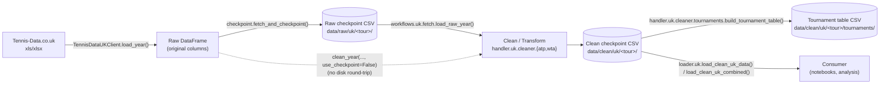

# Tennis-Data.co.uk: Data Flow

[← Tennis-Data.co.uk overview](README.md) · [Data dictionary](data-dictionary-Tennis-Data-UK.md) · [Architecture overview](../../architecture/README.md)

This document describes how a single tour/season of Tennis-Data.co.uk match
data moves from the third-party site to the canonical, analysis-ready
dataset, naming the actual modules and functions involved at each step. For
the schema itself (column names, dtypes, categorical vocabularies) and the
design rationale behind these stages, see
[pipeline-plan.md](pipeline-plan.md)
(status: implemented — this document describes the current, implemented
state; the plan doc additionally records *why* it was designed this way).

## Stages

> TODO: Confirm the exact `clean_year`/`clean_years` signature (raw-DataFrame
> vs. checkpoint-path input) against `workflows/uk/clean.py` if you need to
> call it directly — it wasn't re-derived line-by-line for this diagram.

### 1. Extract

`datasources.tennis_data_uk.client.TennisDataUKClient.load_year(year, tour)`
downloads one season's `.xls`/`.xlsx` file and returns it as a `DataFrame`
with the source's original column names — no renaming, no dtype coercion
beyond what `pandas.read_excel` does natively.

### 2. Raw checkpoint

`datasources.tennis_data_uk.checkpoint.fetch_and_checkpoint(tour, year, client=...)`
persists that raw `DataFrame` to disk unmodified, after two sanity checks:

- `_check_tour_column` — confirms the file actually contains the requested
  tour's data (a real bug this caught: a WTA download that actually
  contained ATP data).
- `_warn_on_schema_drift` — warns if the column set changed vs. the previous
  checkpoint for that tour (catches upstream schema changes, e.g. a new
  bookmaker column).

`raw_checkpoint_path(tour, year)` resolves the file path from
`settings.paths.raw` + `tennis_data_uk.raw_dir_name` /
`raw_filename_template` (see [config](../../architecture/config.md)).

Orchestrated by `workflows.uk.fetch.fetch_and_checkpoint_year()` /
`fetch_and_checkpoint_years()`. `workflows.uk.fetch.load_raw_year()` reloads
a checkpoint for inspection without cleaning it.

### 3. Clean / Transform

`handler.uk.cleaner.atp` / `handler.uk.cleaner.wta` turn a raw `DataFrame`
into the canonical schema:

1. `load_raw_{atp,wta}_csv()` — coerce base dtypes (dates, numerics,
   categoricals) via `handler.uk.cleaner.common.load_raw_uk_csv`.
2. `apply_known_match_fixes()` / `apply_known_best_of_fixes()` — apply the
   hand-verified corrections in `handler.uk.cleaner.known_fixes.{atp,wta}`
   (via `known_fixes._shared.apply_match_fixes`).
3. `check_tournament_consistency()` / `check_reused_tournament_ids()` —
   structural validation; raises if a tournament's core attributes disagree
   across rows or an ID is reused for a different tournament
   (`handler.uk.validator.tournaments.find_uk_inconsistent_tournaments` is
   the lower-level check these build on).
4. Rename to the canonical schema and add key/round columns
   (`add_source_event_key`, `assign_round_codes`, `add_source_match_key`,
   from `handler.uk.cleaner.common`).
5. `validate_clean_uk_{atp,wta}_data()` — final shape/dtype assertions on
   the cleaned output.

This stage never touches the network or the filesystem directly — it only
transforms an in-memory `DataFrame`, which is what lets the same code clean
either a fresh download or a reloaded checkpoint.

### 4. Clean checkpoint

`workflows.uk.clean.clean_year()` / `clean_years()` call the Stage 3
functions and write the result via `clean_checkpoint_path(tour, year)`.
`handler.uk.cleaner.quality.build_uk_quality_report()` /
`update_quality_report()` maintain a shared ATP+WTA data-quality report at
`quality_report_path()`.

### 5. Tournament table

`handler.uk.cleaner.tournaments.build_tournament_table()` aggregates clean
match rows into one row per tournament (e.g. champion, final score).
Orchestrated by `workflows.uk.tournaments.build_uk_tournaments()`, written
to `tournament_table_path()` / `tournament_inconsistencies_path()`.

### 6. Scheduled refresh

`workflows.uk.update.update_current_season()` runs fetch → clean →
tournament-table-rebuild for one or more tour/years, best-effort per year
(a download failure is a warning; a clean failure is an error that fails the
run). This backs `scripts/uk/weekly_update.py`, the unattended/CI entry
point.

### Loading for analysis

`loader.uk.load_clean_uk_data()` / `load_clean_uk_year()` /
`load_clean_uk_data_range()` / `load_clean_uk_combined()` read the Stage-4
clean checkpoints back into memory with dtypes restored (a plain
`pd.read_csv` would lose the categoricals/nullable-ints/parsed-dates that
Stage 3 produced).

## Known-issue registry

Match-level corrections live in `handler/uk/cleaner/known_fixes/` as a list
of `MatchFix` entries (tour, year, human-readable description, source URL,
a boolean-mask matcher, and an apply function). Each fix must match exactly
one row — see
[pipeline-plan.md §5](pipeline-plan.md#5-known-issue-fix-registry)
for the format and the bulk-typo-remap alternative used for category-level
issues.

Resolved: this data-flow document (and the more detailed
[fetch](../../pipelines/tennis-data-uk-fetch.md)/[clean](../../pipelines/tennis-data-uk-clean.md)
pipeline docs) are the current-state reference, kept in sync with the code;
`pipeline-plan.md` is retained specifically for the *design rationale* it
records and is not expected to track every implementation detail going
forward.
