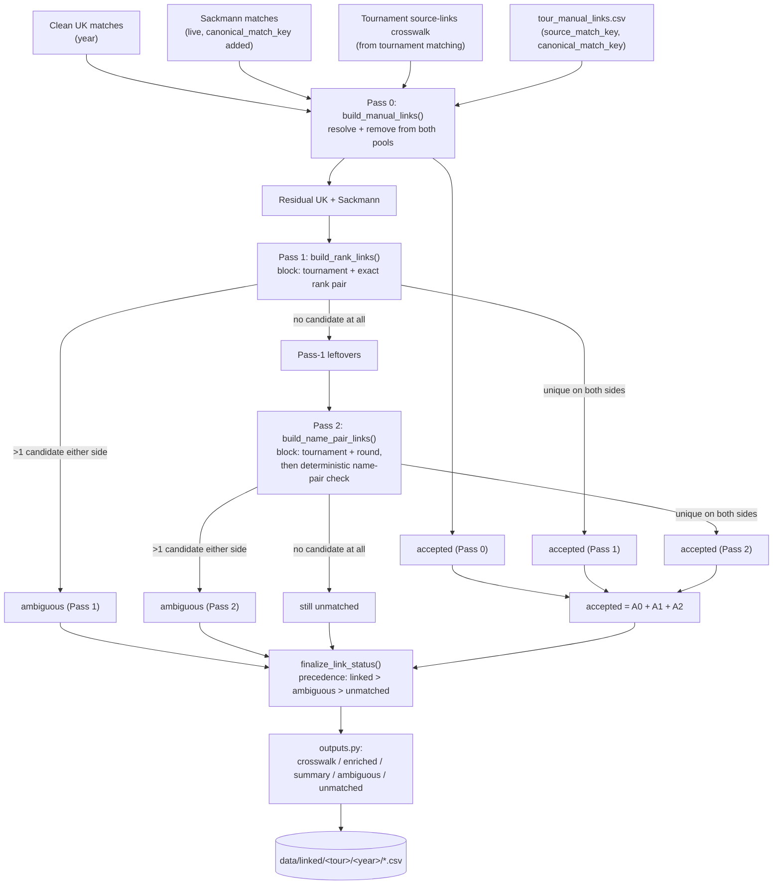

# Cross-Source Match Linking (Tennis-Data UK ↔ Sackmann)

[← Pipelines overview](README.md) · [Cross-source tournament matching](tournament-matching.md) · [Tennis-Data UK clean](tennis-data-uk-clean.md) · [Sackmann data access](sackmann-fetch.md)

> **Prerequisite: [tournament matching](tournament-matching.md) must already
> be built for the tour/year(s) you're linking.** Every pass in this
> pipeline blocks on `official_tournament_id` — the permanent id the
> [tournament matching pipeline](tournament-matching.md) resolves UK and
> Sackmann tournaments to. A tournament that pipeline hasn't resolved yet
> means every match in it falls straight through to `unmatched` here with
> reason `missing_tournament_mapping`, no matter how obviously correct the
> rank/name evidence is. If coverage looks unexpectedly low, check the
> tournament mapping first, not this pipeline.

## Goal

Tennis-Data UK's clean match rows carry betting odds but only abbreviated
player names (`"Fritz T."`) and no stable player id. Sackmann's match rows
carry full names, a real `player_id`, and detailed stats, but no odds. This
pipeline links the two at **match level** — one UK row to (at most) one
Sackmann row — so a downstream consumer can get odds and stats for the same
real-world match from one joined record, without ever fuzzy-matching names
again itself.

## Provenance: adapted from `market-efficiency-lab`

This pipeline is a productionized evolution of a much smaller prototype:
[`link_td_sackmann.py`](https://github.com/Volodymyr4K/market-efficiency-lab/blob/main/sports/tennis/scripts/link_td_sackmann.py)
from the [`market-efficiency-lab`](https://github.com/Volodymyr4K/market-efficiency-lab)
repo (also preserved verbatim in this repo at
[`docs/My-Notes/link_td_sackmann.py`](../My-Notes/link_td_sackmann.py), with
further exploration in
[`Link-UK-Sackmann-NTB.ipynb`](../../Link-UK-Sackmann-NTB.ipynb) /
[`Link-UK-Sackmann-Workflow.ipynb`](../../Link-UK-Sackmann-Workflow.ipynb)).
Understanding what changed between the two is genuinely useful context for
anyone new to this pipeline, since the differences explain most of its
design:

| | Original (`link_td_sackmann.py`) | This repo's pipeline |
|---|---|---|
| **Blocking key** | `(tour, winner_rank, loser_rank)` within a **date window** (`tourney_date` to `tourney_date + 25 days`, since Sackmann's date is the tournament's start, not the match's) | `(year, tour, official_tournament_id, winner_rank, loser_rank)` — the [tournament matching pipeline](tournament-matching.md)'s permanent id replaces the date-window heuristic entirely |
| **Ambiguous candidates** | Silently **dropped** (`~cand.duplicated(...)` on both sides) | **Kept** in a dedicated `ambiguous` table for review — never silently discarded |
| **Residual/"Pass 2" matching** | A **learned** `td_name -> sackmann_id` map, distilled by **majority vote** across every Pass-1-aligned pair (accepted only if ≥90% of votes agree and ≥2 votes exist) | **Deterministic**, rule-based per-row name parsing (`names.py`) — no learning, no cross-match memory; every decision is made fresh from the two names in front of it |
| **Manual overrides** | None | Pass 0: a hand-maintained `(source_match_key, canonical_match_key)` override table, resolved before anything algorithmic runs |
| **Diagnostics** | A coverage percentage printed to stdout | Per-row `review_flag`/`data_quality_flag`/candidate counts, plus a persisted per-(tour, year) linkage summary and an all-years rollup |
| **Output** | One `match_links.parquet` file | Five CSVs per tour/year under `data/linked/{tour}/{year}/` (crosswalk, enriched matches, summary, ambiguous, unmatched) |

The core idea — rank-pair join first, then a residual name-based pass — is
unchanged. Nearly everything else exists because the original's date-window
blocking and majority-vote name learning were reasonable for an exploratory
script but not precise enough once tournament identity was already solved
by a separate, more reliable pipeline.

## Overview

| Layer | Module | Job |
|---|---|---|
| Shared constants | `mapper.matches.uk_sackmann.schema` | Match-method names, crosswalk column lists. |
| Tournament id attachment | `mapper.matches.uk_sackmann.tournament_ids` | Merge `official_tournament_id` onto a source's match rows via the tournament source-links crosswalk. |
| Name matching | `mapper.matches.uk_sackmann.names` | Deterministic (non-fuzzy) UK abbreviated-name ↔ Sackmann full-name compatibility check. |
| Pass 0 | `mapper.matches.uk_sackmann.pass0` | Hand-maintained manual overrides, resolved first. |
| Pass 1 | `mapper.matches.uk_sackmann.pass1` | Tournament-blocked exact rank-pair matching. |
| Pass 2 | `mapper.matches.uk_sackmann.pass2` | Tournament+round-blocked deterministic name-pair matching, for Pass 1's leftovers. |
| Combine | `mapper.matches.uk_sackmann.pipeline` | Run Pass 0 → Pass 1 → Pass 2 and stitch the results together. |
| Diagnostics | `mapper.matches.uk_sackmann.checker` | Simple coverage-summary helpers. |
| Output shaping | `mapper.matches.uk_sackmann.outputs` | Turn the pipeline's raw result into five formalized, persistable tables. |
| Orchestration/persistence | `workflows.mapper.matches.uk_sackmann.build_match_links` | Load inputs, run the pipeline, write the five CSVs, rebuild the all-years rollup. |
| Script | `scripts/mapper/link_matches_uk_sackmann.py` | CLI: one tour + one or more years. |

## TL;DR

For one tour/year, `build_match_links()` loads that year's clean UK matches,
live Sackmann matches, the tournament source-links crosswalk (from
[tournament matching](tournament-matching.md)), and a hand-maintained
manual-override file, then runs `build_manual_rank_and_name_links()`: **Pass
0** resolves any manually-confirmed `(source_match_key, canonical_match_key)`
pairs and removes them from both pools entirely; **Pass 1** blocks on
`(year, tour, official_tournament_id, winner_rank, loser_rank)` and accepts
only pairs unique on both sides; **Pass 2** takes Pass 1's leftovers, blocks
on `(year, tour, official_tournament_id, round)` instead, and accepts a pair
only if the UK winner/loser names are deterministically compatible with the
Sackmann winner/loser names *in that orientation* — no fuzzy matching, no
swapping sides. Ambiguous candidates (more than one plausible counterpart)
are never dropped — they're written out for manual review. The result is
reshaped into five tables (compact crosswalk, UK-plus-linkage "enriched"
table, one-row summary, final ambiguous residuals, final unmatched
residuals with a coarse reason code) and persisted per tour/year, plus an
all-years rollup rebuilt from scratch every run.

## Stages



## 1. Inputs

`build_match_links(tour, year)` (`workflows/mapper/matches/uk_sackmann.py`)
loads four things fresh every run — nothing here reads from a previous
linking run:

- **Clean UK matches** — `loader.uk.load_clean_uk_year(tour, year)` (the
  [clean pipeline](tennis-data-uk-clean.md)'s output).
- **Sackmann matches** — `datasources.sackmann.atp/wta.load_year(year)`, live
  (see [Sackmann data access](sackmann-fetch.md) — no local checkpoint,
  fetched fresh every time).
- **Tournament source-links crosswalk** —
  `loader.mapper.load_tournament_source_links(tour)`, the long/tidy
  `(source, year, source_tournament_id) -> official_tournament_id` table
  the [tournament matching pipeline](tournament-matching.md) maintains.
  This is the hard dependency called out at the top of this doc.
- **Manual-link overrides** — `loader.mapper.load_manual_match_links(tour)`,
  a hand-maintained `{tour}_manual_links.csv` with columns `year`,
  `source_match_key`, `canonical_match_key` (distinct from, and at a finer
  grain than, the tournament-level `manual_matches` file from the
  [tournament matching pipeline](tournament-matching.md#3-manual-overrides-tour_tournament_manual_matchescsv)).

A year missing the UK clean checkpoint raises `FileNotFoundError` (caught
and skipped-with-warning by the script, per year).

## 2. Pass 0: manual overrides (`build_manual_links`)

Runs first, and is treated differently from Pass 1/2 in one important way:
**an unresolvable manual link is a data-entry error, not a "no match"** — if
`manual_links_df` references a `source_match_key`/`canonical_match_key` that
doesn't actually exist in this year's UK/Sackmann data, it **raises**
`ValueError` rather than silently skipping the row. Uniqueness of
`source_match_key`/`canonical_match_key` is checked on all three inputs
(`uk_df`, the derived `sackmann_df["canonical_match_key"]`, and
`manual_links_df` itself) for the same reason — a manual override is meant
to be unambiguous by construction.

Every resolved manual link is removed from **both** pools before Pass 1/2
ever run (`uk_residual0`/`sackmann_residual0` in
`build_manual_rank_and_name_links`), so a manually-confirmed pair can never
be reconsidered — or, worse, wrongly reclaimed for a *different* match — by
either algorithmic pass. `match_method` is always `MATCH_METHOD_MANUAL`, and
every diagnostic column that doesn't apply to a manual override (candidate
counts, round/rank-points agreement) is `NA` — there's no candidate pool to
compare against for a row that was never a candidate in the first place.

## 3. Pass 1: tournament-blocked exact rank pair (`build_rank_links`)

`attach_tournament_ids()` first merges `official_tournament_id` onto both
sides (`tournament_ids.py` — a `validate="many_to_one"` merge that raises if
the crosswalk ever has more than one id for the same source/year/source-id
combination). Rows missing `official_tournament_id`, `winner_rank`, or
`loser_rank` on either side are excluded up front — they structurally can't
produce a rank-pair candidate.

`generate_rank_candidates()` is a plain vectorized inner merge on
`RANK_CANDIDATE_KEY_COLUMNS = [year, tour, official_tournament_id,
winner_rank, loser_rank]` — a UK row can legitimately match more than one
Sackmann row here (and vice versa); resolving that is the next step's job,
not this merge's. `classify_rank_candidates()` then computes, per candidate:

- `source_candidate_count` / `canonical_candidate_count` — how many
  counterparts each side's key maps to among *these* candidates.
- `is_unique` — `True` only when **both** counts are `1`. This is the sole
  acceptance condition; nothing else here can promote or reject a
  candidate.
- `round_agrees`, `winner_rank_points_diff`, `loser_rank_points_diff` —
  corroborating evidence only, attached for later review but never used to
  filter/accept a candidate at this stage.

Accepted rows (`is_unique`) get `match_method =
MATCH_METHOD_TOURNAMENT_RANK_UNIQUE`, `review_flag = False`, and a final
assertion that `source_match_key`/`canonical_match_key` really are 1:1 (a
should-never-happen construction guard). Everything else splits into
`ambiguous` (candidate existed, just not uniquely) and `unmatched_uk_rows`
(no candidate produced at all — missing tournament id, missing rank, or
genuinely no counterpart).

## 4. Pass 2: tournament+round-blocked name pair (`build_name_pair_links`)

Runs on Pass 1's leftovers only: every tournament-attached UK row not in
Pass 1's *accepted* links, and every Sackmann row likewise — deliberately
including rows that were part of a Pass-1 **ambiguous** group, not just
rows with zero candidates, since a rank-pair ambiguity only means *rank*
matching was insufficient; tournament + round + name-pair evidence may
still resolve it uniquely.

The block changes from rank to `NAME_PAIR_KEY_COLUMNS = [year, tour,
official_tournament_id, round]` — round replaces rank specifically because
Pass 2 exists for rows where rank is missing or disagrees between sources.
Within each block, a candidate survives only if
`player_name_compatible(winner_uk, winner_sk)` **and**
`player_name_compatible(loser_uk, loser_sk)` both hold — orientation is
never swapped; a UK winner is only ever compared to the Sackmann *winner*.

### The name-matching algorithm (`names.py`)

This is fully deterministic — no `SequenceMatcher`, no edit distance, no
fuzzy scoring, unlike the tournament-matching pipeline's name similarity:

1. `parse_tennis_data_name("Fritz T.")` splits a UK name into `(surname,
   initials)` by consuming every trailing dotted token (`"Wolf J.J."` →
   surname `wolf`, initials `jj`; `"Varillas J. P."` → surname `varillas`,
   initials `jp`) — a name with no trailing dotted token at all is treated
   as a bare surname with no initials.
2. `normalize_name()` lowercases, strips accents (with an explicit
   translation table for Latin-Extended letters like `Đ`/`Ł`/`Ø` that
   Unicode NFKD normalization does *not* decompose into a base letter +
   accent — those would otherwise be silently **deleted**, not
   transliterated, by a plain NFKD-then-ascii-encode pass), and keeps only
   letters/spaces/hyphens.
3. `player_name_compatible(source_name, canonical_name)` checks whether the
   parsed surname matches some **trailing run** of the canonical (Sackmann)
   name's tokens, once both are compacted to letters-only (so
   `"Auger-Aliassime"` and `"Auger Aliassime"` compare equal). If the source
   has initials, they must match the given-name tokens immediately
   preceding that surname run — either as a single prefix (`"Zh."` →
   `"Zhizhen"`) or one letter per token (`"J.P."` → `"Juan Pablo"`).

`classify_name_pair_candidates()` mirrors Pass 1's `is_unique` logic exactly
(same `source_candidate_count`/`canonical_candidate_count` pattern), but
adds `winner_rank_agrees`/`loser_rank_agrees` as **nullable** booleans (`NA`
when a rank is missing on either side, not just `False`) — this feeds
`_data_quality_flag()`: `"rank_mismatch"` if either rank actively disagrees,
`"missing_rank"` if either is unknown, else `NA`. This flag is attached to
**accepted** Pass-2 links — the name-pair match was still unambiguous, but
the rank evidence is worth flagging for review (`review_flag` itself stays
`False` here; it's reserved for linkage ambiguity, not data-quality
concerns on an otherwise-accepted link).

## 5. Combining the passes (`pipeline.py`)

`build_rank_and_name_links()` runs Pass 1 then Pass 2 on the residual and
concatenates both passes' `accepted`/`ambiguous` (columns differ between
passes — e.g. Pass 1 has raw `winner_rank`/`loser_rank`, Pass 2 has
`winner_rank_agrees`/`data_quality_flag` — absent columns are `NaN` for the
other pass's rows), then **asserts** Pass 1 and Pass 2 never accepted
overlapping `source_match_key`/`canonical_match_key` values — a
should-never-happen invariant given Pass 2 only runs on Pass 1's leftovers,
checked anyway. `build_manual_rank_and_name_links()` wraps that with Pass 0
in front, on the full pre-Pass-0 data, then runs Pass 1+2 on *its* residual.

## 6. Finalizing status (`finalize_link_status`)

Because Pass 2 reconsiders Pass-1-ambiguous rows, the **same**
`source_match_key` can legitimately appear in `ambiguous` (from Pass 1) and
*also* end up accepted — or still ambiguous — by Pass 2. `finalize_link_status`
resolves this with a fixed precedence: **linked > ambiguous > unmatched**.
A key resolved by a later pass is dropped from the earlier bucket entirely;
a key that stays ambiguous keeps **every** candidate row it had (never
collapsed to one row) since a human reviewing it needs to see all the
competing candidates, not just one.

## 7. Output shaping (`outputs.py`)

Four purpose-built tables, all pure functions over the pipeline's
`(accepted, ambiguous, unmatched)` result:

- **`build_match_crosswalk(accepted)`** — the compact lineage table:
  `MATCH_CROSSWALK_COLUMNS` (ids, `match_method`, `review_flag`,
  `data_quality_flag`, candidate counts, agreement diagnostics). Raises if
  either key column isn't unique.
- **`build_enriched_matches(uk_df, sackmann_df, accepted)`** — starts from
  **every** UK row (unmatched rows kept, with null linkage columns) and
  appends a small fixed set of canonical (Sackmann) columns renamed with a
  `canonical_` prefix (`canonical_winner_id`, `canonical_tourney_name`,
  etc.) so they're never confused with the UK source's own columns sitting
  right next to them. `_validate_winner_loser_ids()` is a construction
  guard: it re-derives what `winner_id`/`loser_id` *should* be from
  `canonical_match_key` and raises `AssertionError` if `accepted` ever
  disagrees with the Sackmann row it claims to link to. Also asserts the
  output's row count exactly matches `uk_df`'s — this function must never
  drop or duplicate a UK row.
- **`add_unmatched_diagnostics(unmatched)`** — a coarse, best-effort
  `unmatched_reason` derived purely from columns already attached (no new
  matching logic): `missing_tournament_mapping` (no
  `official_tournament_id` at all — the dependency flagged at the top of
  this doc) → `no_rank_candidate` (rank missing) → `no_name_pair_candidate`
  (everything else), checked in that priority order.
- **`build_linkage_summary(...)`** — one row of coverage/health metrics per
  `(tour, year)`: total/linked/ambiguous/unmatched counts (by unique
  `source_match_key`, never raw candidate rows), a per-method breakdown
  (`linked_manual`/`linked_pass_1`/`linked_pass_2`), and `coverage_pct`.
  **Asserts** `linked + ambiguous + unmatched == uk_total_matches` — every
  UK match must land in exactly one bucket, no exceptions.
  `sackmann_total_matches` is also recorded on this row, but it's
  **informational only** — it plays no part in that reconciliation
  assertion or in `coverage_pct`, both of which are always computed against
  `uk_total_matches`. See below for why.

### Why UK, not Sackmann, is the coverage baseline

Worth flagging explicitly, since it's easy to misread on a first pass
through the persisted rollups
(`data/linked/atp/atp_linkage_summary.csv` /
`data/linked/wta/wta_linkage_summary.csv`): **Sackmann's total is higher
than UK's total in every single year on record.** ATP 2010: `2679` UK
matches vs. `3030` Sackmann matches. WTA 2019: `2472` vs. `2743`. This isn't
a data-quality gap to chase down — Tennis-Data UK is the smaller,
less-complete of the two sources (it doesn't track every event Sackmann
does; events like the Laver Cup/United Cup/Next Gen Finals never get an
`official_tournament_id` at all and so can't even enter Pass 1/2's
tournament block), but it's also the **only** source with betting odds,
which is the entire reason this pipeline exists in the first place. So
`coverage_pct` deliberately answers "what fraction of *UK's own* matches
got linked to a Sackmann counterpart," not "what fraction of all
real-world matches got captured" — `100.0` means UK's data was fully
accounted for, not that this pipeline reproduced Sackmann's larger universe
of matches. A `coverage_pct` under 100 is what's actually worth
investigating; a `sackmann_total_matches` that's larger than
`uk_total_matches` is expected, every year, and not itself a signal of a
problem.

Two more patterns worth knowing from the real rollups when reading them:
`ambiguous_matches` is `0` in nearly every year for both tours (ATP 2011 is
the only exception on record, at `2`) — in practice, whatever Pass 1 leaves
ambiguous, Pass 2's tournament+round+name-pair block almost always resolves
one way or the other by the time `finalize_link_status` runs. And
`linked_manual` is rare by design (`0` for every WTA year on record; ATP
only has `1`–`2` in 2023/2024) — Pass 0 is a narrow, hand-maintained escape
hatch for otherwise-unmappable matches, not a routine part of the pipeline.
A visible dip worth explaining rather than treating as a regression: ATP
2020's `coverage_pct` drops to `95.7%` (vs. `99+%` in every surrounding
year) — that's the COVID-shortened season, where both `uk_total_matches`
(`1267`) and `sackmann_total_matches` (`1462`) are roughly half a normal
year's, and unusual event scheduling that year produced more tournaments
without a clean `official_tournament_id`.

## 8. Workflow & persistence

`build_match_links()` (`workflows/mapper/matches/uk_sackmann.py`) ties
everything together and writes five files per tour/year under
`data/linked/{tour}/{year}/`:

| File | Contents |
|---|---|
| `{tour}_match_links_{year}.csv` | Compact lineage crosswalk (`build_match_crosswalk`). |
| `{tour}_matches_enriched_{year}.csv` | Every UK match + linkage/canonical columns (`build_enriched_matches`). |
| `{tour}_linkage_summary_{year}.csv` | One coverage/health row (`build_linkage_summary`, with `linked_at` populated here — the pure function leaves it `NA` since "when did this run" isn't a pure function's job). |
| `review/{tour}_linkage_ambiguous_{year}.csv` | Final ambiguous candidates, for manual review. |
| `review/{tour}_linkage_unmatched_{year}.csv` | Final unmatched UK rows + `unmatched_reason`. |

Each year's outputs are **overwritten independently** on rerun — other
years are never touched, and raw/clean inputs are never modified. Every run
also calls `rebuild_all_years_summary()`, which rebuilds
`data/linked/{tour}/{tour}_linkage_summary.csv` **entirely from scratch** by
re-reading every year folder's own persisted summary file and
concatenating them — this rollup holds no independent state and is safe to
delete at any time; the per-year files are the only source of truth.

## 9. Script: `scripts/mapper/link_matches_uk_sackmann.py`

```bash
python scripts/mapper/link_matches_uk_sackmann.py --tour atp 2025
python scripts/mapper/link_matches_uk_sackmann.py --tour atp 2010-2025
python scripts/mapper/link_matches_uk_sackmann.py --tour wta 2024 2025
```

Per requested year: calls `build_match_links()`, catches `FileNotFoundError`
(missing clean UK checkpoint for that year) as skip-with-warning, and logs a
one-line coverage summary — `uk_matches=N linked=N (pass1=N pass2=N)
ambiguous=N unmatched=N (XX.X% coverage)`. Exit code: `0` if at least one
year succeeded, `1` if every year was skipped/failed, `2` on a malformed
year argument. `--mapping-dir`/`--linked-dir` override the config-driven
directories.

## Configuration

`settings.mapping` (Pass 0's input) and `settings.linked` (this pipeline's
output), both in `configs/config.yaml`:

| Key | Purpose | Default |
|---|---|---|
| `mapping.match_dir_name` / `mapping.match_manual_links_filename_template` | Pass 0's manual-override file location | `matches` / `{tour}_manual_links.csv` |
| `linked.review_dir_name` | Subdirectory for ambiguous/unmatched review files | `review` |
| `linked.match_links_filename_template` / `enriched_matches_filename_template` / `linkage_summary_filename_template` | Output filenames | `{tour}_match_links_{year}.csv` / `{tour}_matches_enriched_{year}.csv` / `{tour}_linkage_summary_{year}.csv` |
| `linked.linkage_ambiguous_filename_template` / `linkage_unmatched_filename_template` | Review-file filenames | `{tour}_linkage_ambiguous_{year}.csv` / `{tour}_linkage_unmatched_{year}.csv` |

Output root: `settings.paths.linked` (`data/linked/` by default, override via
`TENNIS_DATA_PIPELINE_LINKED_DIR`).

## Known limitations

- **Fully dependent on tournament matching being current** — reiterating
  the top of this doc, since it's the single most common reason coverage
  looks wrong: any tournament missing from the source-links crosswalk sends
  every one of its matches straight to `unmatched` with
  `missing_tournament_mapping`, regardless of how clean the rank/name data
  is.
- **No cross-match name-alias learning**, unlike the original script this
  was adapted from — each Pass-2 decision is made fresh from the two names
  in front of it. A name variant `player_name_compatible` can't parse (e.g.
  an unusual suffix/particle) fails silently as "no candidate," not as a
  reviewable near-miss.
- **Sackmann data is fetched live, every run** — see
  [Sackmann data access](sackmann-fetch.md#known-limitations--current-state);
  a linking run has no local snapshot to fall back on either.
- **Pass 0 requires exact key matches** — a `manual_links.csv` row written
  against one version of the data can silently stop resolving (raising
  `ValueError`, not failing quietly) if the underlying `source_match_key`/
  `canonical_match_key` ever changes shape upstream.

## Testing

`tests/mapper/test_mapper_matches.py` covers Pass 1/Pass 2 candidate
generation, classification, and the combined pipeline;
`test_mapper_matches_manual.py` covers Pass 0 and the full manual+rank+name
pipeline; `test_mapper_matches_outputs.py` covers the four output-shaping
functions in `outputs.py`, including the reconciliation assertion and
winner/loser-id construction guard.
`tests/workflows/mapper/test_workflows_mapper_matches.py` covers the
orchestration/persistence layer, including the all-years rollup rebuild.
