# Sackmann Archive: Data Access Pipeline

[← Pipelines overview](README.md) · [Tennis-Data UK fetch](tennis-data-uk-fetch.md) · [Tennis-Data UK tournament table](tennis-data-uk-tournaments.md)

## Goal

Load Jeff Sackmann's tennis match archive (mirrored on GitHub) into a typed,
enriched `DataFrame` that's safe to concatenate across years/tiers and join
against other sources — without needing a fix registry or a local checkpoint
the way [Tennis-Data UK](tennis-data-uk-fetch.md) does, since this archive is
already clean at the source. "Enriched" here means adding the few columns
the raw archive doesn't have but everything downstream needs: which
year/tour/competition-tier a row came from, and a single stable per-match id.

## Overview

| Layer | Module | Job |
|---|---|---|
| Client | `datasources.sackmann.client.SackmannClient` | Know the mirror's file-naming convention, download a CSV, parse it. |
| Schema | `datasources.sackmann.schema` | File-naming templates + the two column/dtype layouts (singles vs. ATP doubles). |
| Cleaning | `datasources.sackmann.cleaning` | Parse `tourney_date`, coerce every column to its declared dtype, add `canonical_match_key`. |
| Tour helpers | `datasources.sackmann.atp` / `.wta` | One function per competition tier (main tour, qual/challenger, futures, qual+ITF, ATP doubles); add `source_year`/`tour`/`match_type`/`match_level`. |
| Downstream consumer | `workflows.sackmann.tournaments.build_sackmann_tournaments` | The one thing in this repo that actually persists anything derived from this data today — see [known limitations](#known-limitations--current-state). |

**There is currently no `scripts/sackmann/call_sackmann.py`-style fetch
script and no raw/clean checkpoint under `data/raw/` or `data/clean/sackmann/<tour>/`
for match-level data** (only a tournament-*summary* table is persisted — see
below). Every call to `atp.load_year()`/`wta.load_year()` re-downloads from
the GitHub mirror.

## TL;DR

`SackmannClient.load_csv(tour, filename)` downloads one file from the
archive mirror's raw-content URL and parses it with `pd.read_csv(...,
index_col=False)` — no cleaning yet. `cleaning.clean_matches()` /
`clean_doubles_matches()` parse `tourney_date` (`YYYYMMDD` → real dates),
coerce every other column to the dtype declared in `schema.py`, and add
`canonical_match_key` (`tourney_id_match_num`, tie-broken by `round` for
round-robin collisions) — the one column this whole pipeline exists to
guarantee. `atp.load_year()` / `wta.load_year()` (and their `_qual_chall`/
`_futures`/`_qual_itf` siblings) wrap client + cleaning together and tag
every row with `source_year`, `tour`, `match_type`, and `match_level`, so
concatenating tiers/years/tours never loses track of where a row came from.
Nothing is written to disk by this layer — it's called live, every time, by
whatever needs Sackmann data (currently: the tournament-table builder).

## Stages

```mermaid
flowchart LR
    A[("GitHub mirror\nAneeshers/tennis-sackmann-archive")] -->|"SackmannClient.load_csv()\nindex_col=False"| B["Raw DataFrame\n(archive's own columns)"]
    B -->|"cleaning.clean_matches()\nor clean_doubles_matches()"| C["_parse_tourney_date()\nYYYYMMDD -&gt; datetime"]
    C --> D["_coerce_columns()\nInt64 / Float64 / string / category"]
    D --> E["_add_canonical_match_key()\ntourney_id_match_num\n(+round if colliding)"]
    E -->|"atp/wta._load_level_year()"| F["+ source_year, tour,\nmatch_type='singles', match_level"]
    F --> G["In-memory DataFrame\n(no checkpoint written)"]
    G -->|"workflows.sackmann.tournaments\n.build_sackmann_tournaments()"| H[("Tournament table CSV\ndata/clean/sackmann/&lt;tour&gt;/")]
```



## 1. Client: `SackmannClient`

`datasources/sackmann/client.py` is deliberately simpler than the
Tennis-Data UK client — this mirror has a stable, predictable URL shape
(`<base_url>/<tour>/<filename>`, no randomized path segment, no
extension/scheme fallback needed) — but shares the same retry posture:
a `urllib3.Retry` (`retry_total`/`retry_backoff_factor` from config) over
`{429, 500, 502, 503, 504}`, mounted on a `requests.Session`.

`load_csv(tour, filename)` is the one method everything else calls, and it
has one deliberate quirk worth knowing about:

```python
return pd.read_csv(StringIO(response.text), index_col=False)
```

`index_col=False` is there because some archive files (the code comment
names `atp_matches_doubles_*.csv`) have a trailing blank field on every
data row beyond the declared header — without this, pandas' "more data
columns than header columns" heuristic treats the extra trailing field as
an implicit row index, silently shifting every real column's values one
position to the left.

On top of `load_csv`, one method per file the mirror publishes:
`load_matches` (tour-level singles, `{tour}_matches_{year}.csv`),
`load_atp_qual_chall_matches`, `load_atp_futures_matches`,
`load_atp_doubles_matches` (ATP only — the archive stopped collecting
doubles after 2020, requesting a year outside 2000–2020 will just 404),
`load_wta_qual_itf_matches` (WTA's qualifying + ITF matches are one
combined file per year, unlike ATP's separate qual_chall/futures files),
plus `load_players`/`load_rankings_current` for the biography and current
rankings snapshot tables (`atp_players.csv`/`wta_rankings_current.csv`,
etc. — file names differ per tour via `PLAYER_FILE`/`RANKINGS_CURRENT_FILE`
dicts in `schema.py`).

## 2. Schema: two column layouts, deliberately not over-specified

`datasources/sackmann/schema.py` documents (and the module docstring is
explicit about this) that the archive has exactly two column layouts:

- **"singles" (49 columns)** — identical layout across every
  tour/tier/era checked (`atp_matches_*`, `atp_matches_qual_chall_*`,
  `atp_matches_futures_*`, `wta_matches_*`, `wta_matches_qual_itf_*`); only
  the *values* differ by tier (`tourney_level` is `G`/`M`/`A` at tour level
  but a `15`/`25`-style ITF prize-money code for futures; `round` gains
  `Q1`–`Q3` for qualifying rounds).
- **"doubles" (65 columns)** — `atp_matches_doubles_*.csv`, ATP-only,
  2000–2020 only. Stats/seed/entry columns are per *team*
  (one `w_ace` for the pair), but identity columns (id/name/hand/height/
  country/age/rank/rank_points) are per *player*:
  `winner1_*`/`winner2_*`, `loser1_*`/`loser2_*`.

A large shared core (`_SHARED_INT_COLUMNS`, `_SHARED_STRING_COLUMNS`,
`_SHARED_CATEGORY_COLUMNS`) is factored out once and reused by both layouts'
`SINGLES_*`/`DOUBLES_*` column tuples, so a dtype correction only needs to
happen in one place. `tourney_date` is deliberately excluded from every one
of these tuples — `cleaning.py` parses it separately with an explicit
`YYYYMMDD` format, since a generic "coerce to numeric/string/category" pass
wouldn't know to interpret it as a date at all.

Category columns (`surface`, `tourney_level`, `round`, `*_entry`, `*_hand`,
`*_ioc`) are intentionally left with an **open** value set — no fixed
enum/allowlist — because, per the module docstring, pinning down every
`tourney_level`/`round`/entry code across 50+ years and several competition
tiers is exactly the kind of brittle validation that breaks the moment the
archive adds a new code upstream. (Contrast with the Tennis-Data UK
[clean pipeline](tennis-data-uk-clean.md#5-validate-validate_clean_uk_atp_wta_data),
which *does* enforce a closed surface/round set — that source has a much
smaller, source-controlled vocabulary.)

`_assert_disjoint_dtype_groups()` runs at import time as a guard: if a
future edit accidentally lists the same column in two different dtype
tuples, this raises immediately instead of silently applying whichever
`astype()` call happens to run last.

## 3. Cleaning: dtypes, then the one key that matters

`datasources/sackmann/cleaning.py` — `clean_matches()` (singles: main tour +
qual/challenger + futures + WTA qual/ITF) and `clean_doubles_matches()`
(ATP doubles) both run the same three steps:

1. **`_parse_tourney_date()`** — `tourney_date` (a raw `YYYYMMDD` integer,
   e.g. `20230529`) → `pd.to_datetime(..., format="%Y%m%d", errors="coerce")`.
   A tournament's `tourney_date` is its **start date only** — there's no
   per-match date the way Tennis-Data UK has, which is why the derived
   tournament table's `start_date`/`end_date` come out identical for
   Sackmann (see [handler.sackmann.tournaments](#5-downstream-consumer-the-tournament-table) below).
2. **`_coerce_columns()`** — for each column actually present in this
   particular file (a futures file, for instance, won't have every column a
   main-tour file does), coerce to the dtype declared in `schema.py`:
   nullable `Int64` for counts/ranks, nullable `Float64` for ages,
   `string` for names/ids/score, `category` for surface/level/round/entry/
   hand/country. Missing/unparseable values become `pd.NA`, not an
   exception (`pd.to_numeric(..., errors="coerce")`).
3. **`_add_canonical_match_key()`** — the whole point of this module. Builds
   `tourney_id + "_" + match_num` (e.g. `"2023-0540_113"`) as
   `canonical_match_key`, Sackmann's own de facto unique per-match id. The
   one wrinkle handled here: round-robin events (the ATP/WTA season-ending
   "Tournament/Finals") can **reuse** `match_num` across the round-robin
   stage and the knockout stage within the same `tourney_id`. Rather than
   appending `round` to every key unconditionally (which would just be
   noise for the 99%+ of matches that don't collide),
   `key.duplicated(keep=False)` finds only the colliding rows and appends
   `round` to disambiguate *just those* — every other match keeps the plain
   `tourney_id_match_num` form.

This key is not a documentation footnote — it's load-bearing for the
cross-source match-linking pipeline: `mapper/matches/uk_sackmann/` (pass0
manual overrides, pass1/pass2 automated matching, `outputs.py`'s final
acceptance checks) all join on `canonical_match_key` and explicitly assert
it's unique in the Sackmann frame before trusting any link built on top of
it.

## 4. Tour helpers: `atp.py` / `wta.py`

`datasources/sackmann/atp.py` and `.wta.py` are near-identical (ATP has one
extra tier, doubles, that WTA's archive doesn't include). Both funnel every
public `load_*` function through a private `_load_level_year()` /
`_load_level_years()` / `_load_level_range()` trio that:

1. Calls the tier-specific client method (via an injected `loader`
   callable, e.g. `lambda c, y: c.load_atp_qual_chall_matches(y)`).
2. Runs `clean_matches()` (or `clean_doubles_matches()` for ATP doubles) —
   unless the caller passes `clean=False`, which skips straight to the raw
   archive columns (used by, e.g., the client-layer tests).
3. Adds four columns that don't exist in the raw archive at all:
   - **`source_year`** — the requested season, independent of
     `tourney_date` (useful since, unlike Tennis-Data UK, there's no
     separate "does the file's own year agree with its dates" validation
     step here).
   - **`tour`** — `"atp"`/`"wta"`, so concatenating both tours never
     requires re-deriving which is which from `tourney_id` alone.
   - **`match_type`** — hardcoded `"singles"` (doubles rows get
     `"singles"` too today via the same `_load_level_year` helper in
     `atp.py` — see [known limitations](#known-limitations--current-state)).
   - **`match_level`** — one of `MatchLevel.MAIN` / `QUAL_CHALL` /
     `FUTURES` / `QUAL_ITF` (a `StrEnum` in `schema.py`), i.e. *which* file
     this row came from — necessary because, unlike Tennis-Data UK's single
     tour-level file per season, Sackmann splits lower competition tiers
     into separate files that get concatenated together.

Public API per tour: `load_year`/`load_years`/`load_range` (main tour),
`load_qual_chall_year(s)`/`load_qual_chall_range` and
`load_futures_year(s)`/`load_futures_range` (ATP only),
`load_qual_itf_year(s)`/`load_qual_itf_range` (WTA only). Every `_years`
/`_range` variant just downloads and concatenates one season at a time —
there's no batch/parallel fetch, and (unlike the Tennis-Data UK workflow
layer) no per-year `fail_fast`/skip-and-continue option: a bad year raises
and aborts the whole call.

ATP doubles (`load_doubles_year(s)`/`load_doubles_range`, ATP-only,
`client.load_atp_doubles_matches` + `clean_doubles_matches`) is handled by a
separate code path in `atp.py`, **not** the shared `_load_level_year` helper
above — it correctly tags `match_type="doubles"`, but does not add a
`match_level` column at all (there's no tiering for doubles, unlike
singles' main/qual_chall/futures split). A year outside 2000–2020 will
raise `SackmannDownloadError` (404) rather than return an empty frame.

## 5. Downstream consumer: the tournament table

Because there's no persisted match-level checkpoint, the tournament-summary
pipeline (`workflows.sackmann.tournaments.build_sackmann_tournaments`,
backing `scripts/sackmann/build_sackmann_tournaments.py`) downloads live
every run: `module.load_years(years)` (main tour only, ATP or WTA per the
`_LOADERS` dict) → `handler.sackmann.tournaments.build_sackmann_tournament_table()`
→ upsert into `data/clean/sackmann/<tour>/tournaments/sackmann_<tour>_tournaments.csv`.

That table reuses the **same generic aggregator** as the Tennis-Data UK
[tournament table pipeline](tennis-data-uk-tournaments.md#2-generic-aggregator-build_tournament_table)
(`handler.uk.cleaner.tournaments.build_tournament_table` — Sackmann's
wrapper imports it directly rather than duplicating it), keyed on
`tour`/`year`/`tourney_id` (`year` and `tourney_number` are split out of
`tourney_id` first, e.g. `"2023-9900"` → `year=2023`,
`tourney_number="9900"` kept as a **string** since some ids use
non-numeric suffixes like `"D002"` for Davis Cup ties). Two Sackmann-specific
adaptations layered on top of the shared function:

- **`match_status` is inferred from the free-text `score` column** (no
  dedicated status column exists in this archive) — `"W/O"` → `walkover`,
  `"RET"` → `retired`, `"DEF"` → `defaulted`, checked in that order, anything
  else → `completed`.
- **`start_date`/`end_date` always come out equal**, since `tourney_date` is
  a single start-of-event date, not a per-match date — this table cannot
  tell you when a tournament's final was actually played, only when it
  began.

## Configuration

`settings.sackmann` (`config/schemas/sackmann.py`, `configs/config.yaml`):

| Key | Purpose | Default |
|---|---|---|
| `base_url` | Archive mirror's raw-content base URL | `https://raw.githubusercontent.com/Aneeshers/tennis-sackmann-archive/main` |
| `request_timeout_seconds` | Per-request timeout | `30.0` |
| `retry_total` / `retry_backoff_factor` | `urllib3.Retry` tuning | `3` / `1.0` |
| `clean_dir_name` / `tournament_dir_name` / `tournament_filename_template` / `tournament_inconsistencies_filename_template` | Tournament-table output location/naming (the only thing this pipeline persists) | `sackmann` / `tournaments` / `sackmann_{tour}_tournaments.csv` / `sackmann_{tour}_tournament_inconsistencies.csv` |

## Known limitations / current state

- **No raw or clean checkpoint for match-level data.** Every consumer
  re-downloads from GitHub every time; there's no local snapshot to fall
  back on if the mirror is down or changes, unlike Tennis-Data UK's
  `data/raw/`/`data/clean/` checkpoints. The module docstrings in
  `workflows/sackmann/tournaments.py` and `scripts/sackmann/build_sackmann_tournaments.py`
  call this out explicitly as a known gap, not an oversight.
- **No known-fix registry.** The archive is treated as already-clean at the
  source — there's no `known_fixes`-style mechanism here the way there is
  for [Tennis-Data UK](tennis-data-uk-clean.md#2-known-fixes); a bad value
  in the upstream archive flows straight through.
- **ATP doubles has no `match_level` column.** Its loader
  (`load_doubles_year(s)`/`load_doubles_range`) is a separate code path from
  the shared `_load_level_year` helper the singles tiers use, so it tags
  `match_type="doubles"` correctly but doesn't add `match_level` — worth
  knowing before filtering/grouping on `match_level` across a mixed
  singles+doubles frame.
- **No batch fault-isolation.** `load_years`/`load_range` raise immediately
  on the first failing year — there's no `fail_fast=False`-style
  skip-and-continue option like the Tennis-Data UK fetch/clean workflows
  have.

## Testing

`tests/sources/sackmann/test_sackmann_client.py` covers URL-building and
the `index_col=False` CSV-parsing quirk; `test_sackmann_cleaning.py` covers
dtype coercion and `canonical_match_key` (including the round-robin
collision case); `test_sackmann_atp.py`/`test_sackmann_wta.py` cover each
tier-specific loader's filename and the `source_year`/`tour`/`match_type`/
`match_level` tagging, all against mocked HTTP responses (no live network
calls in tests).
