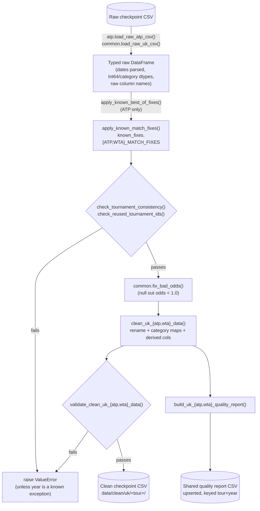

# Tennis-Data UK: Clean Pipeline

[← Pipelines overview](README.md) · [Fetch pipeline](tennis-data-uk-fetch.md) · [Architecture: handler](../architecture/handler.md) · [Data flow reference](../data-sources/tennis-data-uk/data-flow.md) · [Design rationale (plan doc)](../data-sources/tennis-data-uk/pipeline-plan.md)

## Goal

Turn a Stage-2 raw checkpoint — tennis-data.co.uk's own column names,
values, and mistakes, untouched — into a canonical-schema, structurally
validated dataset that's safe to concatenate across tours/years and build
downstream tables (tournament summaries, cross-source links) on top of.
"Clean" here means three distinct things happen, in this order: **fix**
known bad values, **check** the result is structurally sound, then
**rename/derive** into the canonical schema and **validate** the output
shape.

## Overview

| Layer | Module | Job |
|---|---|---|
| Typed load | `handler.uk.cleaner.common.load_raw_uk_csv` (via `atp.load_raw_atp_csv` / `wta.load_raw_wta_csv`) | Parse dates, coerce numeric/category dtypes — still raw column names/values. |
| Known fixes | `handler.uk.cleaner.known_fixes.{atp,wta}` | Hand-verified single-match corrections (`MatchFix`) and whole-category typo fixes. |
| Structural checks | `handler.uk.validator.tournaments` (via `common.check_tournament_consistency` / `check_reused_tournament_ids`) | Raise if a tournament's own metadata disagrees across its rows, or an id is reused by two different tournaments. |
| Canonicalize | `handler.uk.cleaner.{atp,wta}.clean_uk_{atp,wta}_data` | Rename to canonical column names, map category values, derive key/round/players-remaining columns. |
| Validate | `handler.uk.cleaner.common.validate_clean_uk_data` | Assert the cleaned output's shape/values are internally consistent. |
| Quality report | `handler.uk.cleaner.quality` | Flatten per-season metrics into a shared, upserted ATP+WTA report CSV. |
| Workflow | `workflows.uk.clean` | Orchestrate load → clean → write clean checkpoint → update quality report, for one or many years. |
| Script | `scripts/uk/clean_uk_data.py` | CLI over the workflow, with a per-year OK/FAILED summary. |

## TL;DR

`clean_atp_season(df, year)` / `clean_wta_season(df, year)` run, in order:
(1) known-issue fixes — best-of corrections and hand-verified single-match
score/date/id fixes registered for that exact tour/year/match, (2) two
structural checks that **raise** if a tournament's metadata is internally
inconsistent or its id collides with a different tournament, (3)
odds-value cleanup, then (4) the actual rename into canonical column
names/values plus derived columns (`source_event_key`, `round` bracket
codes, `players_remaining`, `source_match_key`), finishing with (5) a hard
validation pass that raises `ValueError` on any remaining structural
problem. `workflows.uk.clean.clean_year()` wraps that for one season and
writes both the clean checkpoint CSV and an updated shared quality-report
row; `clean_years()` does the same for a batch, recording per-year
success/failure instead of aborting the whole run.

## Stages



## 1. Typed load: `load_raw_{atp,wta}_csv`

Before any tour-specific logic runs, `common.load_raw_uk_csv()`
(`handler/uk/cleaner/common.py`) turns the raw checkpoint's plain-text CSV
columns into real dtypes, while keeping the source's original column names
and values:

- Strips stray whitespace from `RAW_STRING_COLS` (`Location`, `Tournament`,
  `Winner`, `Loser`) — the code comment notes real cases like `"Dubai "`.
- Parses `Date` with `format="mixed"` (season-to-season date-format drift,
  e.g. `1/1/23` vs. `2000-01-03`), and hardcodes `Year` from the checkpoint's
  own year rather than trusting anything derived from `Date`.
- Runs `pre_dtype_hook` right here — this is where `fix_atp_category_typos`
  / `fix_wta_category_typos` slot in (see below), because they must rewrite
  values in `Comment`/`Surface`/`Tier` **before** those columns become an
  immutable `category` dtype a few lines later.
- Coerces `int_cols` (ranks, points, set scores) to nullable `Int64` (`pd.to_numeric(...,
  errors="coerce")` — non-numeric values become `pd.NA`, not an exception),
  `float_cols` similarly to `float`, and everything left over (bookmaker odds
  columns, which vary year to year) is coerced numeric too.
- Casts `category_cols` (`Series`/`Court`/`Surface`/`Round`/`Comment`) to
  `category` dtype last, since the category-typo fixes above must already
  have run.

`atp.load_raw_atp_csv` / `wta.load_raw_wta_csv` just supply the tour-specific
column lists (`atp_cols.RAW_INT_COLS`/`RAW_CATEGORY_COLS`, etc. — WTA
additionally has `RAW_FLOAT_COLS` for fractional ranking points in some
seasons) and the matching `pre_dtype_hook`.

## 2. Known fixes

Two genuinely different mechanisms live under `known_fixes/`, on purpose
(see the module docstring): a value that's wrong on **one match** vs. a
value that's wrong across **many rows of one category**.

### 2a. Category-typo fixes

`fix_atp_category_typos` / `fix_wta_category_typos`
(`known_fixes/{atp,wta}.py`) fix whole mislabeled *values*, run once per
season before the affected column becomes `category` dtype:

| Tour | Field | Bad value(s) | Fix | Occurrences |
|---|---|---|---|---|
| ATP | `Comment` | `Sched` | `Completed` | 1, 2019 (US Open final — full score already present) |
| ATP | `Comment` | `Rrtired` | `Retired` | 1, 2021 (Astana Open) |
| WTA | `Tier` | `WTA251`…`WTA276` | `WTA250` | 1 each, 2007 (Excel drag-fill typo) |
| WTA | `Comment` | `Walkoer` | `Walkover` | 1, 2007 |
| WTA | `Surface` | `Greenset` | `Hard` | 31, 2007 (Sunfeast Open — Greenset is a hard-court brand name) |
| WTA | `Best of` | `5` | `3` | 1, 2007 (Pacific Life Open — WTA singles is always best-of-3) |

### 2b. Best-of corrections (ATP only)

`apply_known_best_of_fixes()` (`atp.py`) is a *rule*, not a per-match
lookup: it forces `Best of` to 5 for every match at a Grand Slam
(`ATP_BEST_OF_5_TOURNAMENTS`), and to 3 for every non-Masters,
non-Grand-Slam match. Masters Series rows are left alone deliberately —
best-of-5 legitimately applied only to Masters *finals*, and only before
the 2008 season, so a blanket rule would be wrong there; see
`CONSISTENCY_INFO_COLS` below for how the structural check tolerates that
one field varying within a Masters event. One documented genuine exception
to "always 3 outside Slams/Masters" exists — 2006 Gstaad was a real
best-of-5 final at a regular event — and is handled by a single-match
`MatchFix`, applied *after* this blanket rule so it isn't immediately
undone.

### 2c. Single-match fixes: the `MatchFix` contract

`MatchFix` (`known_fixes/_shared.py`) is a frozen dataclass: `tour`, `year`,
a human-readable `description`, an optional Wikipedia/official `source_url`,
a `match` predicate (`DataFrame -> bool Series`), and an `apply` function
(`DataFrame, mask -> None`, mutates in place). `apply_to()` is the safety
mechanism: it re-runs `match` every time and **raises** if it finds
anything other than exactly one row —

```python
if matched != 1:
    raise ValueError(
        f"Expected exactly 1 row for known fix '{self.description}' "
        f"({self.tour} {self.year}), found {matched}. The raw source "
        "may have changed; review before re-applying this fix."
    )
```

— so a future upstream re-scrape that changes or removes the row this fix
targets fails loudly instead of silently mis-applying (or silently
no-op'ing). `apply_match_fixes(df, tour, year, fixes)` filters
`ATP_MATCH_FIXES`/`WTA_MATCH_FIXES` down to the current `tour`/`year` and
calls `apply_to()` on each match.

`ATP_MATCH_FIXES` currently has **11** entries, `WTA_MATCH_FIXES` **7** —
each documented inline with the tournament, the actual bad value observed,
and (usually) a source URL. Two representative shapes:

- **A missing/corrupted score, real result known from elsewhere** — e.g.
  the 2001 Memphis 2nd Round (`_fix_memphis_r2_2001`) had `Wsets`/`Lsets`
  recorded as `1-1` on a "Completed" match; the fix sets the actual 3rd-set
  score `[7, 6, 2, 1]`.
- **Winner/Loser fully or partially swapped** — e.g. 2023 Marrakech R16 and
  2024 ATP Finals Turin (`_fix_marrakech_r16_2023`,
  `_fix_turin_finals_rr_2024`) both had the winner and loser's name-keyed
  columns (rank, points, odds) swapped; each fix is verified by cross-checking
  the betting line against the real favorite/underdog (documented in the
  fix's own `description`) and, for Turin, cross-checked against Sackmann's
  data for the same match. Turin's game-by-game score columns were already
  correctly positioned, so *only* the name-keyed columns move — a good
  example of why each fix is hand-written rather than a generic
  "swap winner/loser" helper.

`set_values()` (`_shared.py`) is a small helper these fixes share: it
assigns a dict of column→value pairs onto the masked row, casting to `str`
first if the target column happens to be string-dtyped (relevant for tests
that load a raw CSV without the package's own numeric-coercion loader).

## 3. Structural checks: consistency and reused ids

Both checks live in `handler/uk/validator/tournaments.py` and are called via
tour-specific wrappers (`atp.check_tournament_consistency`, etc.) that
resolve tour-specific `info_cols`/`known_exception_years` from
`atp_cols.py`/`wta_cols.py`.

- **`find_uk_inconsistent_tournaments(df, key_columns, info_cols)`** — groups
  by `key_columns` (`[id_col, "Year", "Location"]`) and finds any group where
  an `info_cols` field (`Tournament`, `Series`, `Court`, `Surface` —
  `CONSISTENCY_INFO_COLS`) has more than one distinct value. `Best of` is
  **deliberately excluded** from this list, because it legitimately varies
  by round within a pre-2008 Masters event (see §2b). Returns both a
  `metrics` table (distinct-value counts per inconsistent key) and the
  actual `affected_rows`, for manual review.
- **`find_uk_reused_tournament_ids(df, id_col, disambiguating_cols)`** —
  groups by `id_col` alone (not `Location`), because two same-week
  tournaments can share a raw tournament id while being at different
  locations — the code comment gives Stockholm/Tokyo both being "ATP 58" as
  the motivating real case that the consistency check above (keyed on
  `Location` too) would silently miss.

`common.check_tournament_consistency()` / `check_reused_tournament_ids()`
are the wrappers `atp.py`/`wta.py` call: both **raise `ValueError`** if
either finder returns any rows, *unless* `year` is in a hardcoded
known-exception set (`KNOWN_TOURNAMENT_INCONSISTENCY_YEARS` /
`KNOWN_REUSED_TOURNAMENT_ID_YEARS`, both currently `{2023}` for ATP) — a
year that's been manually reviewed and accepted as-is rather than fixed
value-by-value.

These checks run **after** the known-fixes stage and **before**
canonicalization/rename, which is the whole point of the fix-then-check
ordering: a fix that resolves e.g. a reused-id issue (2020 Montpellier
mislabeled as Pune's id — `_fix_montpellier_final_2020`) actually prevents
the corresponding check from failing, instead of the check firing on data
that's about to be fixed anyway.

## 4. Canonicalize: `clean_uk_{atp,wta}_data`

Once fixes + checks pass, `clean_uk_atp_data()` / `clean_uk_wta_data()`
(`atp.py`/`wta.py`) do the actual transform, in this order:

1. `add_source_event_key()` — builds `source_event_key` from
   `{year}_{uk_tournament_id}_{slugified location}_{slugified tournament
   name}` (via `common.add_source_event_key`, keyed on `ATP`/`WTA`
   respectively) — this is the join key later stages (e.g. tournament
   linking) key off of.
2. `assign_round_codes()` — replaces raw `"1st Round"`/`"2nd Round"`/... with
   bracket codes (`R16`/`R32`/...) by counting **backward from the
   quarterfinals** per tournament (`common.assign_round_codes`,
   `NUMBERED_ROUNDS_ASCENDING` / `BRACKET_CODES_FROM_QF`), since draw sizes
   vary too much (an ATP 250 vs. a Grand Slam) for a fixed label→code
   mapping to be correct everywhere.
3. `df.rename(columns=cols.COLUMN_MAP)` — the actual raw→canonical rename
   (`ATP`→`uk_tournament_id`, `WRank`→`winner_rank`, `B365W`→
   `odds_b365_winner`, etc. — see `atp_cols.COLUMN_MAP`/`wta_cols.COLUMN_MAP`
   for the full mapping).
4. Category **value** remaps via `.cat.rename_categories()` (not
   `.replace()` — a `category` dtype can't accept a value that isn't already
   a declared category) — `series`, `surface`, `match_status`; `is_outdoor`
   is mapped straight to a nullable `boolean` since it's only ever
   Indoor/Outdoor.
5. `common.add_players_remaining()` — bracket size entering the round (`2`
   for a final up to `256`), from a fixed `ROUND_SIZE_MAP`, *except*
   round-robin (`RR`) events, whose group size isn't fixed and is instead
   inferred per event from the actual match counts
   (`_infer_round_robin_field_size`) — deliberately robust to a mid-event
   alternate substitution by using `1 + the most matches anyone in the
   event played` as the group size, rather than a raw distinct-player count.
6. `add_source_match_key()` — a unique per-match key
   (`{source_event_key}_{date}_{round}_{winner}_{loser}`, normalized names)
   — `round` is included specifically so a same-day round-robin rematch
   (e.g. two players who meet again in the final) doesn't collide.
7. Hardcode `source="tennis_data_uk"` and `tour="atp"`/`"wta"`, then
   `ensure_columns()`/`ensure_odds_columns()` backfill any column that
   doesn't exist for this tour/season as all-`NaN` — e.g. `WPts`/`LPts`
   don't exist at all before 2005, and WTA has no `set_4`/`set_5` columns
   since WTA singles is always best-of-3 — specifically so ATP and WTA
   clean output share one identical column set (`COLUMN_ORDER`).

`clean_atp_season(df, year)` / `clean_wta_season(df, year)` are the actual
public entry points that run the full sequence: fixes → checks →
`common.fix_bad_odds()` (nulls out any decimal odds `< 1.0` rather than
guessing at the real value — logged per column) → canonicalize → (inside
canonicalize) validate.

## 5. Validate: `validate_clean_uk_{atp,wta}_data`

`common.validate_clean_uk_data()` is the last thing `clean_uk_{atp,wta}_data`
calls, and it's a hard gate — any failure raises `ValueError` immediately,
there is no "warn and continue" path here. Checks, in order:

- All of `_REQUIRED_CLEAN_COLS` (16 canonical columns, e.g.
  `source_event_key`, `players_remaining`, `match_status`) are present.
- `surface`/`round` only contain values in `expected_surfaces` /
  `expected_rounds`.
- No row is missing `players_remaining` where `round` is set, and none has
  `players_remaining < 2`.
- `source_match_key` has no duplicates.
- `match_date`'s year matches the `year` column — with an explicit
  exception for December dates in the *prior* calendar year (e.g. Brisbane
  or Doha's first round often falls in late December), and a `fillna(False)`
  guard so a nullable-`Int64`/`NaT` comparison that evaluates to `pd.NA`
  doesn't silently get skipped by `.any()`.
- No row has identical `winner_name`/`loser_name`.
- `best_of` is only in `valid_best_of` — `{3, 5}` for ATP, `{3}` for WTA.
- Every `completed` match has a first-set score, and no completed match has
  `winner_sets <= loser_sets`.
- No odds column has a value `< 1.0` (should already be nulled by
  `fix_bad_odds`, so this is a genuine double-check).

## 6. Quality report

`handler/uk/cleaner/quality.py` builds and maintains a **shared** ATP+WTA
report, not a per-tour one:

- `build_uk_quality_report(df, tour)` flattens one cleaned season into a
  single-row `DataFrame`: row count, duplicate-key count,
  `match_status` value counts, count of completed matches missing any odds,
  and missingness percentage per column (only columns with any missing
  values are included).
- `update_quality_report(report_path, quality_report)` **upserts** that row
  into the on-disk report, keyed on the `tour_year` index the row is built
  with — re-cleaning a season overwrites only that season's row
  (`~duplicated(keep="last")`), then fills genuinely-zero metrics
  (`status_count_*`, `missing_pct_*`, etc.) with `0` rather than leaving
  them `NaN` for seasons that had none of that condition, sorts by
  `(tour, year)`, and rounds to 4 decimal places.

Both `workflows.uk.clean._clean_and_write_year()` calls this after writing
the clean checkpoint, so the report always reflects the most recently
cleaned version of every season.

## 7. Workflow: `workflows/uk/clean.py`

- `clean_checkpoint_path(tour, year, clean_dir)` /
  `quality_report_path(clean_dir)` — resolve output paths from
  `settings.tennis_data_uk.clean_dir_name`/`clean_filename_template`/
  `quality_report_relpath`.
- `_clean_and_write_year()` (private) is the actual shared implementation:
  load the raw checkpoint, dispatch to `atp.clean_atp_season` /
  `wta.clean_wta_season`, build the quality report row, write the clean CSV,
  upsert the quality report. Both public functions below call this.
- `clean_year(tour, year, ...) -> Path` — one season, logs a
  `"Wrote N rows to <path>"` line, returns the clean checkpoint path.
- `clean_years(tour, years, ..., fail_fast=False) -> list[CleanYearResult]`
  — a batch: each year's outcome (`success`, `rows`, `error`) is recorded
  independently; a failure is logged (`logger.error`, message only — not a
  full traceback, unlike the fetch workflow's `logger.exception`) and
  appended as a failed result, **not raised**, unless `fail_fast=True`.
- `log_clean_summary(tour, results)` — prints a per-year OK/FAILED table plus
  an overall `"N/M year(s) succeeded"` line.

## 8. Script: `scripts/uk/clean_uk_data.py`

Thin CLI over `clean_years()` + `log_clean_summary()`:

- `--tour {atp,wta}` (required) and one or more year tokens
  (`parse_years()` expands both single years and `start-end` ranges, e.g.
  `2010-2015 2020`, and de-duplicates via a `set`).
- `--raw-dir` / `--clean-dir` override the config-driven checkpoint
  directories (useful for pointing at a scratch directory in tests).
- `--fail-fast` propagates straight to `clean_years(..., fail_fast=True)`.
- Exit code: `0` only if every requested year succeeded, else `1`; `2` on an
  invalid year argument (e.g. a malformed range).

## Configuration

`settings.tennis_data_uk` (relevant keys beyond the ones the
[fetch pipeline](tennis-data-uk-fetch.md#configuration) already covers):

| Key | Purpose | Default |
|---|---|---|
| `clean_dir_name` / `clean_filename_template` | Stage-4 checkpoint location/naming | `uk` / `uk_{tour}_singles_clean_{year}.csv` |
| `quality_report_relpath` | Shared ATP+WTA quality report, relative to the clean dir | `analysis/uk_quality_report.csv` |

Output root: `settings.paths.clean` (`data/clean/` by default, override via
`TENNIS_DATA_PIPELINE_CLEAN_DIR`).

## Known limitations

- **Known-fix registries are hand-curated and can silently go stale** — a
  fix's `apply_to()` will raise if its target row disappears, but there's no
  equivalent alarm for a *new* bad row of the same shape appearing in a
  future season; each fix is single-match by design, not a general rule.
- **`KNOWN_TOURNAMENT_INCONSISTENCY_YEARS`/`KNOWN_REUSED_TOURNAMENT_ID_YEARS`
  are an escape hatch, not a fix** — a year in that set has its check
  skipped entirely for the whole season, not just the specific rows that
  triggered it originally.
- **`clean_years` failures log a message only, not a traceback** — harder to
  debug a batch failure from logs alone than the fetch workflow's
  equivalent (`logger.exception`); the raised `Exception`'s `str()` is all
  that's recorded in `CleanYearResult.error`.

## Testing

`tests/handler/uk/cleaner/test_common.py` covers the shared
rename/derivation/validation helpers; `test_known_fixes.py` covers the
`MatchFix` contract and category-typo fixes; `test_quality.py` covers the
report build/upsert logic; and `test_schema_parity.py` asserts ATP and WTA
clean output share the same column set end to end. Note:
`handler.uk.validator.tournaments.find_uk_inconsistent_tournaments` /
`find_uk_reused_tournament_ids` (the two structural checks in §3) have no
dedicated unit test today — `test_tournaments.py` in this same directory
tests a different module (`handler.uk.cleaner.tournaments`, the
tournament-*summary* builder — see the
[tournament table pipeline](tennis-data-uk-tournaments.md)), not the
validator.
