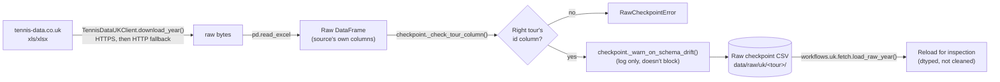

# Tennis-Data UK: Fetch Pipeline

[← Pipelines overview](README.md) · [Architecture: workflows](../architecture/workflows.md) · [Data flow reference](../data-sources/tennis-data-uk/data-flow.md) · [Design rationale (plan doc)](../data-sources/tennis-data-uk/pipeline-plan.md)

## Goal

Get one tour/season off tennis-data.co.uk and onto disk as an unmodified
"raw checkpoint" CSV, so every later stage (cleaning, tournament tables,
analysis) starts from a stable, offline snapshot instead of re-downloading —
and risking a source file that has since changed or disappeared — every time
it's needed.

## Overview

| Layer | Module | Job |
|---|---|---|
| Client | `datasources.tennis_data_uk.client.TennisDataUKClient` | Know the URL shape, download the bytes, parse to a `DataFrame` with the source's own column names. |
| Checkpoint | `datasources.tennis_data_uk.checkpoint` | Sanity-check a downloaded `DataFrame`, then write/read it as a CSV under `data/raw/uk/<tour>/`. |
| Workflow | `workflows.uk.fetch` | Wire the two together for one or many years; expose a reload-without-cleaning helper. |
| Script | `scripts/uk/call_tennis_data_uk.py` | CLI: turn `--year`/`--start-year`/`--end-year` into a year list, fetch each one, print a one-line result. |

## TL;DR

`TennisDataUKClient.load_year(year, tour)` downloads a season's `.xlsx` (or
`.xls` for seasons up to 2012) and returns it as a `DataFrame` completely
unmodified. `checkpoint.write_raw_checkpoint()` runs two guardrails — is this
really the requested tour's data, did the column set unexpectedly change? —
and writes it to `data/raw/uk/<tour>/uk_<tour>_singles_raw_<year>.csv`.
`workflows.uk.fetch.fetch_and_checkpoint_year()` / `_years()` chain those two
for one or several years, logging and skipping past a bad year in a
multi-year batch rather than aborting it. Nothing in this pipeline cleans,
renames, or validates the data — that's the
[clean pipeline](tennis-data-uk-clean.md).

## Stages

## 1. Client: building the URL and downloading

`TennisDataUKClient` (`datasources/tennis_data_uk/client.py`) hides two
things about tennis-data.co.uk that would otherwise break a naive
downloader:

- **A randomized path segment.** Every season file sits behind a URL shaped
  like `https://www.tennis-data.co.uk/<path_prefix>/2024/2024.xlsx`.
  `path_prefix` defaults to `DEFAULT_PATH_PREFIX` (a last-known-good,
  hardcoded value) unless overridden by config
  (`TENNIS_DATA_UK_PATH_PREFIX`). `discover_path_prefix()` scrapes
  `DATA_PAGE_URL` for the current segment via `_PATH_PREFIX_PATTERN` and
  updates `self.path_prefix` — call it (and update config) if downloads start
  404ing across the board.
- **A file-extension and directory-naming switch.** WTA URLs use a
  `w`-suffixed year directory (`2024w/2024.xlsx` vs. ATP's `2024/2024.xlsx`,
  see `_year_directory()`), and seasons up to
  `_LEGACY_EXTENSION_CUTOFF_YEAR` (2012) were only ever published as `.xls`,
  not `.xlsx`. `_extension_order(year)` returns `(preferred, fallback)` so
  the right extension is tried first without giving up if the other one is
  actually what's live.

`download_year()` tries every `(scheme, extension)` combination — all HTTPS
URLs first via `_try_urls()`, then HTTP as well if `allow_http_fallback` is
set *and* the HTTPS attempts weren't a clean, unambiguous 404 — and raises
`TennisDataUKDownloadError` listing every URL's error if all attempts fail.
`_try_urls` also tracks `all_not_found`: if every HTTPS URL failed with an
actual 404 (`_is_not_found`), there's no point trying HTTP as well, since a
404 means the file isn't there, not that HTTPS is broken.

The session itself (`_create_session`) wraps a `urllib3.util.Retry`
(`total`/`backoff_factor` from `retry_total`/`retry_backoff_factor` in
config) over the transient status codes `{429, 500, 502, 503, 504}` — so a
flaky response is retried by `urllib3` before `download_year` ever sees it
as a hard failure. 404 is deliberately *not* in that set, since retrying a
genuinely missing file wastes time.

`load_year(year, tour)` is the actual entry point everything else calls: it
runs `download_year()` then `pd.read_excel()` on the raw bytes — no
renaming, no dtype coercion beyond what `read_excel` does natively (so
columns still have their original tennis-data.co.uk names, e.g. `ATP`,
`WRank`, `B365W`).

## 2. Checkpoint: sanity-check, then write

`checkpoint.write_raw_checkpoint(df, tour, year, raw_dir)`
(`datasources/tennis_data_uk/checkpoint.py`) is the only place a downloaded
`DataFrame` gets persisted, and it runs two checks first:

- **`_check_tour_column()`** — confirms the `DataFrame` actually has the
  requested tour's own id column (`ATP` or `WTA`, via `_TOUR_ID_COLUMN`).
  This isn't a hypothetical: the code comment cites a real incident where a
  2024 WTA download actually contained ATP data. If the *other* tour's
  column is present instead, it raises `RawCheckpointError` naming which
  tour it looks like; if neither column is present, it raises a generic
  "no id column found" error. Either way, nothing is written.
- **`_warn_on_schema_drift()`** — if a checkpoint already exists at the
  target path, compares its column set (read via `pd.read_csv(path,
  nrows=0)`, so no data rows are actually loaded) against the new download's
  and **logs** (does not raise) any added/removed columns. This is how a new
  bookmaker column, or one tennis-data.co.uk quietly drops, gets noticed
  instead of silently propagating downstream.

Only after both checks pass does it write via `df.to_csv(path, index=False)`.
The path comes from `raw_checkpoint_path(tour, year, raw_dir)`, which
resolves `raw_dir` from `settings.paths.raw / tennis_data_uk.raw_dir_name`
(default `data/raw/uk/`) and the filename from
`tennis_data_uk.raw_filename_template`
(`uk_{tour}_singles_raw_{year}.csv`) — both overridable via
`configs/config.yaml` or environment variables.

`fetch_and_checkpoint(tour, year, client=None, raw_dir=None)` is the
one-call version of "download, then write": build or reuse a client,
`load_year()`, `write_raw_checkpoint()`, return the `DataFrame`.

Re-running a fetch for a year that already has a checkpoint **overwrites
it** — there's no append-only history here; the raw checkpoint is a
snapshot of "what the source currently says", not a log of every download.

## 3. Workflow: multi-year orchestration

`workflows/uk/fetch.py` is a thin layer over the two modules above, and is
what scripts and the scheduled update actually call:

- `fetch_and_checkpoint_year(tour, year, client=None, raw_dir=None) -> Path`
  — calls `checkpoint.fetch_and_checkpoint()`, logs a
  `"[ATP 2024] Wrote N rows to <path>"`-style line, and returns the
  checkpoint path.
- `fetch_and_checkpoint_years(tour, years, client=None, raw_dir=None,
  fail_fast=False) -> list[Path]` — loops over `years`, calling the above
  per year. A failure for one year is logged with `logger.exception` (full
  traceback) and **skipped**, not raised, unless `fail_fast=True`. This is
  deliberate: a multi-year backfill shouldn't die on the one year
  tennis-data.co.uk hasn't published yet, or a transient network blip on
  one iteration.
- `load_raw_year(tour, year, raw_dir=None) -> DataFrame` — reloads an
  *existing* raw checkpoint with proper dtypes, delegating to
  `handler.uk.cleaner.{atp,wta}.load_raw_{atp,wta}_csv`, but does **not**
  run any cleaning. It exists purely to inspect a checkpoint (e.g. in a
  notebook) without paying for or triggering the full clean pipeline.

## 4. Script: `scripts/uk/call_tennis_data_uk.py`

The CLI's only real job is turning `--year` / `--start-year` / `--end-year`
into the sorted list of years its own `fetch_years()` helper iterates over
(`_resolve_years()`):

- No year flags at all → the current year only.
- `--year 2024` alone → just `{2024}`.
- `--start-year` and/or `--end-year` → an inclusive range. `--end-year`
  defaults to `--year` if given, else the current year; `--start-year`
  defaults to a hardcoded per-tour value,
  `_DEFAULT_START_YEAR = {"atp": 2000, "wta": 2007}` (the first season
  tennis-data.co.uk actually publishes for each tour).
- Both a single `--year` and a range can combine (`years` is a `set`, so
  they're just unioned).
- `--no-write` still downloads (so real row counts and network errors are
  visible) but skips checkpointing entirely, for a dry run.

Each requested year is fetched via `fetch_and_checkpoint_year()` directly
inside `fetch_years()`'s loop — the script does **not** call the
`fetch_and_checkpoint_years()` workflow helper, so there is no per-year
try/except here; a failure on any year raises immediately and aborts the
rest of the batch. (Contrast with `scripts/uk/weekly_update.py`, which goes
through `update_current_season()` and is best-effort per year — see the
[clean pipeline doc](tennis-data-uk-clean.md) for that path.)

## Configuration

`settings.tennis_data_uk` (`config/schemas.py`, `configs/config.yaml`):

| Key | Purpose | Default |
|---|---|---|
| `request_timeout_seconds` | Per-request timeout | `30.0` |
| `retry_total` / `retry_backoff_factor` | `urllib3.Retry` tuning for transient HTTP errors | `3` / `0.5` |
| `path_prefix` | Override the randomized URL path segment | blank → client's last-known-good default |
| `raw_dir_name` / `raw_filename_template` | Stage-2 checkpoint location/naming | `uk` / `uk_{tour}_singles_raw_{year}.csv` |

Output root: `settings.paths.raw` (`data/raw/` by default, override via the
`TENNIS_DATA_PIPELINE_RAW_DIR` env var).

## Known limitations / failure modes

- **A stale `path_prefix` fails silently until every URL combination
  404s.** There's no proactive check; `discover_path_prefix()` is the fix,
  but nothing calls it automatically on a 404 burst.
- **No content hash or diff on re-fetch.** Re-running a year that hasn't
  actually changed still rewrites the file; `_warn_on_schema_drift` only
  catches column-set changes, not value-level changes (e.g. a corrected odd
  or score on the source's own site).
- **`call_tennis_data_uk.py` aborts a multi-year run on the first failure**
  (see above) — use `scripts/uk/weekly_update.py` /
  `update_current_season()` instead if per-year fault isolation is needed.

## Testing

`tests/sources/tennis_data_uk/test_client.py` covers URL-building and the
extension/scheme fallback order; `test_checkpoint.py` covers the
tour-mismatch and schema-drift guardrails.
