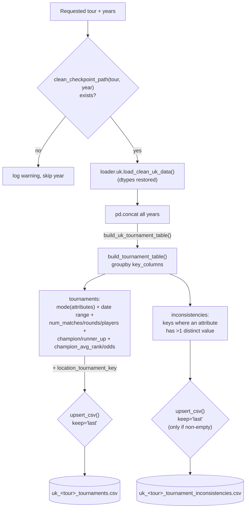

# Tennis-Data UK: Tournament Table Pipeline

[← Pipelines overview](README.md) · [Clean pipeline](tennis-data-uk-clean.md) · [Architecture: workflows](../architecture/workflows.md)

## Goal

Collapse match-level clean data (one row per match) into **one row per
tournament** — champion, runner-up, surface, date range, match counts — so
downstream consumers (analysis, cross-source tournament linking) don't have
to re-derive "who won Wimbledon 2019" from raw match rows every time.
Structural disagreements within a tournament (e.g. two rows claiming
different surfaces for the same event) are surfaced in a companion CSV
rather than silently resolved.

## Overview

| Layer | Module | Job |
|---|---|---|
| Generic aggregator | `handler.uk.cleaner.tournaments.build_tournament_table` | Tour-agnostic groupby: any match-level `DataFrame` + key/attribute column names → one row per tournament + an inconsistency table. |
| UK-specific wrapper | `handler.uk.cleaner.tournaments.build_uk_tournament_table` | Same, pre-bound to the canonical clean-schema column names, plus a cross-year `location_tournament_key`. |
| Workflow | `workflows.uk.tournaments.build_uk_tournaments` | Load every requested year's clean checkpoint, concat, aggregate, upsert into the tour's shared tournament CSV (+ inconsistencies CSV). |
| Script | `scripts/uk/build_uk_tournaments.py` | CLI over the workflow. |

## TL;DR

`build_uk_tournaments(tour, years)` loads each requested year's **already
cleaned** checkpoint (`loader.uk.load_clean_uk_data`, skipping — with a
warning, not an error — any year that hasn't been cleaned yet), concatenates
them into one multi-year `DataFrame`, and hands it to
`build_uk_tournament_table()`. That function groups matches by
`tour/year/uk_tournament_id/location`, takes the most-common (`mode`) value
of each descriptive attribute (name, series, surface, best-of, court),
computes the date range and match/round/player counts, and pulls the
champion/runner-up straight from whichever row's `round == "F"`. Any
tournament whose attributes weren't actually consistent across its own
matches is captured separately, never silently averaged/guessed away. Both
outputs are **upserted** (not overwritten) into `data/clean/uk/<tour>/tournaments/`,
so re-running a handful of years only touches those years' rows.

## Stages

## 1. Input: only already-cleaned years

`build_uk_tournaments()` (`workflows/uk/tournaments.py`) does **not** clean
anything itself — it's Stage 5, strictly downstream of the
[clean pipeline](tennis-data-uk-clean.md). For each requested year it checks
`clean_checkpoint_path(tour, year, clean_dir).exists()`; a missing year is
logged as a warning and skipped, not an error, so a partial year range
doesn't block the rest. If **none** of the requested years have a clean
checkpoint, it raises `FileNotFoundError` — there'd otherwise be nothing to
build a table from. Every year that does exist is loaded with
`loader.uk.load_clean_uk_data()` (dtypes restored: categoricals, nullable
ints, parsed dates — a plain `pd.read_csv` on the clean CSV would lose all
of that) and concatenated into one `DataFrame` spanning every requested
year before aggregation.

## 2. Generic aggregator: `build_tournament_table`

This is the actual grouping/summarizing logic
(`handler/uk/cleaner/tournaments.py`), written tour- and even
source-agnostic (it's also reused for Sackmann data elsewhere in the repo)
— every column name is a parameter with a Tennis-Data-UK-shaped default.
Given `key_columns` (what uniquely identifies a tournament) and
`attribute_columns` (what's expected to be constant within one):

- **Grouping key.** For raw data the default is
  `["source_year", "TournamentNumber", "Location"]`; for clean data (via the
  wrapper, see below) it's `["tour", "year", "uk_tournament_id", "location"]`.
  `location` has to be in the key because a raw tournament-number column is
  reused across seasons and, in rare weeks, across two concurrent
  tournaments in the same season.
- **Attributes: mode, not first/last.** `_mode_or_na()` takes the *most
  frequent* value per group for each attribute column
  (`Tournament`/`Series`/`Court`/`Surface`/`Best of` for raw data;
  `tournament_name`/`series`/`surface`/`best_of`/`is_outdoor` for clean
  data) — this smooths over a stray single-row data-entry error without
  needing a fix registry entry for every such case, at the cost of masking
  genuine inconsistencies unless you also check…
- **…the inconsistency table.** Computed by the *same* groupby
  (`nunique()` per attribute column), filtered to keys where any attribute
  has more than one distinct value. This is never folded into or hidden by
  the mode-based `tournaments` table — it's returned as a second,
  independent `DataFrame` (`TournamentTable.inconsistencies`) specifically
  so these get reviewed rather than quietly smoothed over by the mode
  aggregation above.
- **Date range + counts.** `start_date`/`end_date` are the min/max of a
  per-row parsed date (`format="mixed"`, same drift-tolerant parsing used
  elsewhere in this pipeline); `num_matches` is just the group size.
- **Optional derived columns**, each only added if the relevant source
  column(s) were supplied/exist:
  - `round_column` → `num_rounds` (distinct round codes played).
  - `match_status_column` → one `num_<status>_matches` column per distinct
    status seen *anywhere* in the input (not just within that tournament),
    so every tournament row has a real `0` rather than a missing column for
    a status it never had.
  - `winner_column` + `loser_column` → `num_players` (distinct entrants,
    counted from the union of winners and losers).
  - `round_column` + `winner_column` + `loser_column` → `champion`/
    `runner_up`, taken directly from whichever row has
    `round_column == final_round_value` (`"F"` by default) — **not**
    inferred from win counts, so a tournament whose final wasn't
    played/recorded correctly leaves these `NA` rather than guessing.
  - `rank_column`/`odds_column` (only meaningful together with the above)
    → `champion_avg_rank`/`champion_avg_odds`: the mean of that column
    across **the champion's own matches** in the tournament
    (`_champion_match_stats`), i.e. how the eventual champion was ranked/
    priced on average across their run, not just in the final.
- Raises `KeyError` up front if `df` is missing any requested
  `key_columns`/`attribute_columns`/`date_column` — fails fast rather than
  producing a table with silently-empty columns.

## 3. UK-specific wrapper: `build_uk_tournament_table`

`build_uk_tournament_table(df)` is `build_tournament_table` pre-bound to the
canonical clean-schema names — `CLEAN_TOURNAMENT_KEY_COLUMNS`
(`tour`/`year`/`uk_tournament_id`/`location`) and
`CLEAN_TOURNAMENT_ATTRIBUTE_COLUMNS` (`tournament_name`/`series`/`surface`/
`best_of`/`is_outdoor`), `match_date` as the date column,
`winner_name`/`loser_name`/`round`/`match_status`/`winner_rank`/
`odds_avg_winner` wired in so every optional derived column above gets
populated. On top of the generic result it adds one more column:

- **`location_tournament_key`** — `slugify(location) + "_" + slugify(tournament_name)`
  (via `common.normalize_key_value`). Unlike `source_event_key` (added back
  in the clean pipeline), this key deliberately **excludes** `year` and
  `uk_tournament_id`, so the same host city + tournament name produces the
  same key across every season — this is the stable key later used to join
  this tour's tournament table against another source's (e.g. Sackmann's)
  tournament table, since neither source's own numeric tournament id is
  reliable across years (see
  [tournament_linker.md](../scripts/tournament_linker.md) for that
  cross-source join).

## 4. Persistence: two upserted CSVs, never an overwrite

Both outputs of `build_uk_tournament_table()` are written via the shared
`workflows._csv_upsert.upsert_csv()` helper, **keyed on
`CLEAN_TOURNAMENT_KEY_COLUMNS`**, with `keep="last"` (the freshly computed
rows win over what's on disk — the opposite convention from the
hand-editable crosswalk files in the
[tournament linker](../scripts/tournament_linker.md), since this table is
fully machine-derived and never hand-corrected in place):

- `tournament_table_path(tour)` →
  `data/clean/uk/<tour>/tournaments/uk_<tour>_tournaments.csv` — every
  tournament row, upserted (existing rows for years *not* in this run are
  preserved; rows for years that *are* in this run are replaced).
- `tournament_inconsistencies_path(tour)` →
  `data/clean/uk/<tour>/tournaments/uk_<tour>_tournament_inconsistencies.csv`
  — only written/updated if `result.inconsistencies` is non-empty for this
  run; never silently dropped even though the main table already picked a
  mode value for the same rows.

`upsert_csv()` itself: reads the existing CSV (if any, with `start_date`/
`end_date` parsed as dates), concatenates the new rows, drops duplicates by
key column keeping the requested side, backfills any `num_*` column that's
missing on one side of the concat with `0` (a missing count means "none
seen this run", not "unknown"), sorts by key columns, and writes back out.

## 5. Workflow: `build_uk_tournaments`

Ties 1–4 together and returns `(table_path, tournament_count,
inconsistency_count)` — `tournament_count` is the size of the **combined**
(post-upsert) table, not just this run's rows, while `inconsistency_count`
is only *this run's* inconsistencies. Logs a summary line either way, plus
a separate warning naming the inconsistencies path if any were found.

## 6. Script: `scripts/uk/build_uk_tournaments.py`

Thin CLI: `--tour {atp,wta}` (required) plus one or more year tokens
(`parse_years()` — same single-year/range-expansion helper as
`clean_uk_data.py`), `--clean-dir` to override the config-driven input
directory, `--verbose` for debug logging. No `--fail-fast`-style flag exists
here since there's nothing per-year to isolate failures on — the whole
multi-year `DataFrame` is aggregated in one pass; a bad year is either
missing (skipped, per §1) or already would have failed at clean time.
Always exits `0` on success, `2` only on a malformed year argument.

## Configuration

`settings.tennis_data_uk` (beyond what the
[clean pipeline](tennis-data-uk-clean.md#configuration) already covers):

| Key | Purpose | Default |
|---|---|---|
| `tournament_dir_name` | Subdirectory under `<clean_dir>/<tour>/` | `tournaments` |
| `tournament_filename_template` | Tournament-table filename | `uk_{tour}_tournaments.csv` |
| `tournament_inconsistencies_filename_template` | Inconsistencies-table filename | `uk_{tour}_tournament_inconsistencies.csv` |

## Known limitations

- **Mode aggregation can mask a genuine attribute change mid-tournament**
  (e.g. a rain-delayed match moved indoors) as easily as it smooths over a
  typo — the inconsistency table is the only signal that something
  disagreed; nothing forces a human to actually go look at it.
- **`champion`/`runner_up` require a row with `round == "F"` to exist at
  all** — a tournament whose final was walked over, cancelled, or simply
  missing from the raw source produces `NA` for champion/runner-up/champion
  averages rather than falling back to e.g. the highest-round players
  remaining.
- **`num_players` counts distinct names, not distinct people** — the same
  data-entry inconsistency that can affect `winner_name`/`loser_name`
  elsewhere in the clean pipeline (e.g. an accent or suffix variant) would
  double-count a player here; nothing in this stage re-validates name
  consistency.
- **Re-running a year overwrites its row unconditionally** (`keep="last"`)
  — there's no hand-correction workflow for this table the way there is for
  the [tournament crosswalk](../scripts/tournament_linker.md); if a value
  here is wrong, the fix belongs upstream in the clean pipeline, not in this
  CSV.

## Testing

`tests/handler/uk/cleaner/test_tournaments.py` covers
`build_tournament_table`/`build_uk_tournament_table` directly (attribute
mode/inconsistency detection, champion/runner-up derivation,
`location_tournament_key`). There is no dedicated test for
`workflows.uk.tournaments.build_uk_tournaments` (the load-concat-upsert
orchestration) or `_csv_upsert.upsert_csv` itself today.
