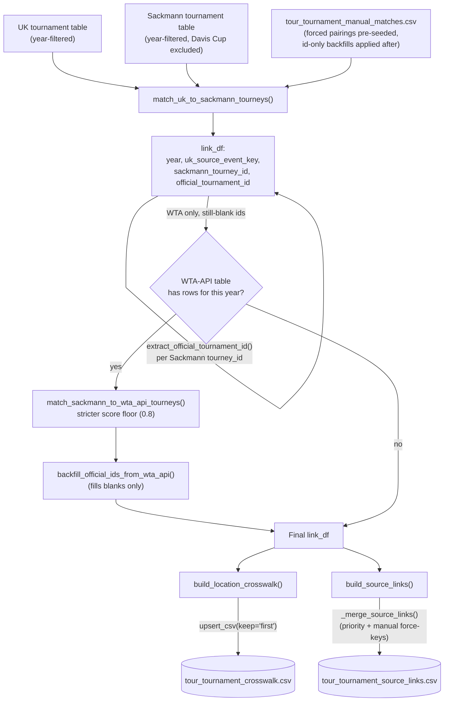

# Cross-Source Tournament Matching

[← Pipelines overview](README.md) · [Tennis-Data UK tournament table](tennis-data-uk-tournaments.md) · [Sackmann data access](sackmann-fetch.md) · [WTA API tournament table](wta-api-tournaments.md)

## Goal

Give every tournament instance (one tour, one year, one event) a single
**permanent `official_tournament_id`** — the same numeric id ATP.com/
WTA.com themselves use — and record how each of this repo's three
independent data sources refers to that same instance, so that:

1. Match-level data from Tennis-Data UK and Sackmann can eventually be
   linked to each other (the actual match-linking pipeline consumes this
   mapping's output — see `mapper/matches/uk_sackmann/`), and
2. Any future analysis that needs "give me every source's data for the
   2024 Australian Open" has one stable key to join on, instead of three
   sources' worth of incompatible, source-local tournament numbering.

This is genuinely one of the harder pipelines in the repo because **none of
the three sources agree on how to identify a tournament**, and two of them
actively get in each other's way (see [§1](#1-why-this-is-hard-three-sources-three-id-systems)).
Getting a wrong match here doesn't just lose one row — it mints a wrong
permanent id that everything downstream (crosswalk, source links, eventual
match linking) then treats as ground truth, which is why so much of this
pipeline's design is about *never guessing when unsure* and *never letting
an automatic rerun silently undo a human's correction*.

## Overview

| Layer | Module | Job |
|---|---|---|
| Matching logic (pure) | `mapper.tournaments` | Score/match candidate pairs, extract permanent ids, build the crosswalk/source-links tables. No file I/O. |
| Orchestration/persistence | `workflows.mapper.tournaments.build_tournament_mapping` | Load each source's tournament table, call the matcher, upsert the two output CSVs with careful never-clobber merge rules. |
| Typed reload | `loader.mapper` | Re-read the mapping CSVs with `official_tournament_id` restored to a real nullable int. |
| Script | `scripts/mapper/build_tournament_mapping.py` | CLI: one tour + one or more years, prints weak matches for review. |

## TL;DR

For a given tour/year, `build_tournament_mapping()` loads that year's
already-built [UK](tennis-data-uk-tournaments.md) and
[Sackmann](sackmann-fetch.md) tournament tables and fuzzy-matches them
(`match_uk_to_sackmann_tourneys`) on normalized name + date proximity +
surface, greedily pairing the best-scoring unique matches and leaving
anything below a score floor unmatched rather than forcing a bad pair.
Sackmann's own tournament id (`tourney_id`) usually embeds the permanent
`official_tournament_id` and it's extracted directly
(`extract_official_tournament_id`); when it can't be (pre-2016 WTA seasons
use a non-numeric id), and only for WTA, a **second** independent match
against the [WTA-tournaments-API table](wta-api-tournaments.md) backfills
it, using a stricter score floor since a wrong match there mints a wrong
permanent id rather than just leaving a gap. A hand-maintained
`manual_matches` CSV can force a pairing or backfill an id the automatic
matching can't resolve, and — critically — **once a row is upserted with a
resolved id, or is a forced manual match, no future automatic rerun can
silently change or overwrite it.** The result is two growable, upserted
reference tables: a `location -> official_tournament_id` crosswalk and a
long/tidy per-source id-links table.

## 1. Why this is hard: three sources, three id systems

| Source | Its own id | Problem |
|---|---|---|
| Tennis-Data UK | `uk_tournament_id` | Resets `1`–`60` **every season** and is reused/reshuffled — not globally unique even within one tour, so it's unusable as a join key across years. Matching/persisting for this source is keyed on `source_event_key` instead. |
| Sackmann | `tourney_id` (`"{year}-{tourney_number}"`) | `tourney_number` embeds the permanent `official_tournament_id` for the vast majority of rows — verified empirically at **1688/1745** non-Davis-Cup rows across 2000–2026 — but not all: one 2016 Olympics row uses an `O16`-style code, 2016–2020 used an unrelated `M0xx` numbering scheme for ~13–14 Masters/500 events *each* of those years, and **pre-2016 WTA seasons use an entirely non-numeric id** (e.g. `"2010-W-INT-THA-01A-2010"`). All of these parse to a blank id rather than a guessed wrong one. |
| WTA-tournaments-API | `tournamentGroup.id` | Already the permanent id directly, no extraction needed — but it only exists for WTA, and this repo only uses it as a *backfill* source for ids the other two legs couldn't resolve, not as a primary matching input. |

Names don't line up cleanly either: Tennis-Data UK often uses a **sponsor
name** (e.g. `"BMW Open"`), Sackmann almost always uses the **host city**
(e.g. `"Munich"`), and the WTA API has its own `group_name`/`title`
conventions that diverge from both (the code comment for
`WTA_API_MIN_MATCH_SCORE` calls out `"Stanford"` scoring 0.7–0.79 against
`"ASTANA"`/`"SAN JOSE"` despite being entirely different tournaments — close
enough on the general name-similarity metric to be dangerous). This is why
matching checks **both** the UK sponsor name and the UK host-city location
against Sackmann's name, and why the Sackmann↔WTA-API backfill uses a
stricter score floor than everything else.

## Stages



## 2. The matching algorithm (`match_uk_to_sackmann_tourneys`)

Pure function, no I/O — given one tour/year's already-loaded UK and
Sackmann tournament tables, every UK/Sackmann pair is scored:

- **Name similarity** (`difflib.SequenceMatcher.ratio()`, 50% weight) —
  computed against **both** the UK sponsor name and the UK host-city
  `location` (via `normalize_tournament_name`: lowercased, accents
  stripped, non-alphanumeric collapsed to single spaces — so `"Queen's
  Club"` and `"Queens Club"` compare equal), and the **higher** of the two
  scores wins.
- **Date proximity** (`date_score`, 40% weight) — `1.0` for identical start
  dates, decaying linearly to `0.0` at `MAX_DATE_DIFF_DAYS` (10 days) apart.
- **Surface match** (10% weight) — a flat `1.0`/`0.0`.

Every candidate pair is sorted by score descending, then assigned
**greedily**: the best-scoring pair is taken first, then the next-best pair
that doesn't reuse either side, and so on, stopping as soon as a
candidate's score drops below `MIN_MATCH_SCORE` (`0.5`, overridable via
`settings.mapping.min_match_score`) since nothing better remains in the
sorted order. Anything left over — on either side — is kept as an
**unmatched row** (blank on the other side) rather than forced into a wrong
pair; this is why `link_df` has one row per matched pair *plus* one row per
leftover UK or Sackmann tournament, not just the matches.

Once matching is done, `official_tournament_id` is derived purely from
Sackmann's own id via `extract_official_tournament_id()` — split
`tourney_id` on the first `-`, and if the remainder is all-digits, that's
the id; otherwise `pd.NA`. No fallback guessing happens at this stage.

## 3. Manual overrides (`{tour}_tournament_manual_matches.csv`)

A hand-maintained CSV (`year`, `uk_source_event_key`, `sackmann_tourney_id`,
`official_tournament_id`, plus a free-text `note` column in practice — see
the real WTA file, which documents entries like *"Backfilled via cross-year
location consistency (Sydney)"*) that serves **three distinct purposes**,
distinguished by which columns are filled in on a given row:

1. **Force a specific UK↔Sackmann pairing** — both `uk_source_event_key`
   and `sackmann_tourney_id` filled in. These rows are **pre-seeded** into
   `matched_uk_keys`/`matched_sack_ids` *before* the automatic matcher runs,
   so it can never touch, reconsider, or reassign them, win or lose.
2. **Backfill an `official_tournament_id` the automatic extraction
   couldn't resolve** (the `M0xx`-era rows) — just `sackmann_tourney_id` +
   `official_tournament_id` filled in. The UK side is still matched
   normally by the automatic matcher; only the id itself is overridden
   *after* matching, via a lookup keyed on `sackmann_tourney_id`.
3. **Document a UK-only id when no Sackmann counterpart exists at all**
   (an edition entirely missing from Sackmann's archive) — just
   `uk_source_event_key` + `official_tournament_id` filled in, applied via
   a separate lookup keyed on `uk_source_event_key`, `sackmann_tourney_id`
   left blank on that row.

The file is filtered to the requested `year` internally
(`load_tournament_manual_matches` reads the whole multi-year file; the
matcher slices it down), so callers always pass the full file. Case 1 is
applied as pre-seeding (before matching); cases 2 and 3 are applied as
overrides layered on top of `link_df` after matching and after
`extract_official_tournament_id`, which is exactly what lets a case-2/3
row backfill an id even where automatic extraction found *nothing at all*.

## 4. WTA-API backfill, the second-chance matcher (WTA only)

Even after manual overrides, some `official_tournament_id`s remain blank —
most commonly, pre-2016 WTA seasons where Sackmann's `tourney_id` was never
numeric to begin with. For WTA only, `build_tournament_mapping()` checks
whether the [WTA-tournaments-API table](wta-api-tournaments.md) has rows for
the requested year; if so, every Sackmann tournament still missing an id
(`unresolved_sackmann_ids`) is matched a **second time**, this time directly
against the API table (`match_sackmann_to_wta_api_tourneys`) — same scoring
approach (name/date/surface, 50/40/10) but against the API's `group_name`/
`title` instead of UK's name/location.

This backfill uses **`WTA_API_MIN_MATCH_SCORE = 0.8`**, stricter than the
general `MIN_MATCH_SCORE = 0.5` — the module-level comment is explicit about
why: Sackmann↔WTA-API name conventions diverge more than UK↔Sackmann's do,
and a wrong match here doesn't just leave a gap (like an unmatched UK/
Sackmann row would) — it **mints a wrong permanent id** that gets persisted
as if it were ground truth. `backfill_official_ids_from_wta_api()` then
fills *only* still-blank ids in `link_df` — an id already resolved by
extraction or a manual override is never touched — and the whole step is a
no-op (not an error) if the API table doesn't exist for that year at all
(e.g. every ATP run, since there's no ATP equivalent of this API).

## 5. Crosswalk: a stable, cross-year lookup by location

`build_location_crosswalk(link_df, df_uk_tourneys)` builds a **growable
`location_key -> official_tournament_id` table**. The insight: a UK
tournament's host city is stable across years, so once a location's been
matched here once, it never needs fuzzy name/date matching again for a
future year — just normalize the new year's location and look it up.

The wrinkle: a location isn't always unique to one tournament — Paris hosts
both Roland Garros and the Paris Masters; the real WTA crosswalk shows
Adelaide the same way (`adelaide` → Adelaide International, but
`adelaide|adelaide international 1` / `adelaide|adelaide international 2`
→ two *different* ids for the split 2021 editions). This is detected
automatically — a `nunique` count of `official_tournament_id` per
normalized location — and **only** ambiguous locations fall back to a
composite `location|tournament_name` key; every other (unambiguous)
location keeps the plain, bare-location key. This is exactly why the
crosswalk CSV has both bare (`abu dhabi`) and composite
(`abu dhabi|abu dhabi wta women s tennis open`) keys side by side.

## 6. Source links: the long/tidy per-source table

`build_source_links(link_df)` is deliberately schema-stable as new sources
get added: one row per `(official_tournament_id, year, source,
source_tournament_id)` — `tennis_data_uk`'s `source_event_key` and
Sackmann's `tourney_id` are just two rows tagged with different `source`
values pointing at the same `official_tournament_id`. Onboarding a fourth
source later needs zero schema changes here, only more rows. A row is kept
even when `official_tournament_id` is still unresolved (real example: the
persisted CSV has `sackmann,2007-W-SL-AUS-01A-2007` rows with a real,
already-resolved id in this case, but the mechanism equally applies to
rows where it's blank) — a confirmed UK↔Sackmann match is never discarded
just because the permanent-id leg isn't known yet; it can be backfilled
later without re-doing the name/date matching.

`pivot_source_links()` is a read-only convenience on top of the persisted
long table — pivots it wide (one `<source>_id` column per source) so "what's
the Sackmann id for this UK tournament" is a single row filter instead of a
groupby, without re-running any matching.

## 7. Persistence: two files, two very different never-clobber rules

This is the part of the pipeline most worth reading carefully, because the
crosswalk and the source-links table are merged onto their existing CSVs in
**different** ways, both deliberately:

- **Crosswalk** (`upsert_csv(..., key_columns=["location_key"],
  keep="first")`) — simple: an existing row **always** wins over a freshly
  computed one. Hand corrections made directly in the CSV are the source of
  truth and can never be clobbered by rerunning the mapper.
- **Source links** (`_merge_source_links`, custom) — smarter, because a
  plain `keep="first"` would also freeze a row that was persisted with a
  **still-blank** `official_tournament_id` forever, even after a later
  `manual_matches` backfill resolves it. The actual rule: an existing row
  with a **non-blank** id wins over a freshly computed one — *unless* that
  exact `(source, year, source_tournament_id)` key has an explicit
  `manual_matches` override in **this run** (`_manual_force_keys`), in which
  case the freshly computed value wins even over an existing non-blank id.
  That last clause exists specifically so a manual correction can fix a
  key that an earlier, buggy automatic match had already persisted
  wrong-but-non-blank — the code comment cites a real case this was added
  for: a 2022 WTA Melbourne Summer Set 1/2 id swap.

There's also a **known gap**, actively surfaced rather than silently
tolerated: `_warn_on_crosswalk_conflicts()` logs a warning when a *bare*
(non-composite) `location_key` would resolve to a different id than what's
already on file, for a location that doesn't yet have any composite keys.
`build_location_crosswalk` can only detect ambiguity **within one year's own
data** — a bare location reused by a genuinely different tournament in a
*separately processed* year silently keeps whichever id was written first
(`keep="first"`), with the new conflicting id dropped and no record it ever
existed. The docstring cites the actual incident this guard was added
after: the 2016–2018 WTA Finals' id at `"singapore"` was silently lost when
a later run for 2025's unrelated new Singapore Open reused the same bare
key. The warning can't auto-fix this (the composite key needs the other
year's tournament name, which isn't available in the run that overwrites
it) — it only makes the conflict visible so it can be hand-corrected.

## 8. Script: `scripts/mapper/build_tournament_mapping.py`

```bash
python scripts/mapper/build_tournament_mapping.py --tour atp 2025
python scripts/mapper/build_tournament_mapping.py --tour atp 2010-2025
python scripts/mapper/build_tournament_mapping.py --tour wta 2024 2025 --review-threshold 0.95
```

Per requested year: calls `build_tournament_mapping()`, catches
`FileNotFoundError` (either tour's tournament table missing for that year)
as a **skip-with-warning**, not a hard failure, then logs matched-count
summaries. Any matched pair — UK↔Sackmann *or* the WTA-API backfill —
scoring below `--review-threshold` (default `0.9`, independent of the
matcher's own `0.5`/`0.8` acceptance floors) is printed in full for manual
eyeballing; nothing is auto-rejected at this stage, a low score is just
worth double-checking (and hand-correcting via `manual_matches` if wrong)
before trusting it downstream. `--uk-clean-dir`/`--sackmann-clean-dir`/
`--wta-api-clean-dir`/`--mapping-dir` override the config-driven
directories (e.g. for pointing at scratch data in tests). Exit code: `0` if
at least one year succeeded, `1` if every requested year was skipped/failed,
`2` on a malformed year argument.

## Configuration

`settings.mapping` (`config/schemas/mapping.py`, `configs/config.yaml`):

| Key | Purpose | Default |
|---|---|---|
| `tournament_dir_name` | Subdirectory under `data/mapping/` | `tournaments` |
| `crosswalk_filename_template` / `source_links_filename_template` / `manual_matches_filename_template` | Output filenames | `{tour}_tournament_crosswalk.csv` / `{tour}_tournament_source_links.csv` / `{tour}_tournament_manual_matches.csv` |
| `min_match_score` | UK↔Sackmann acceptance floor (`mapper.tournaments.MIN_MATCH_SCORE`'s config-driven default) | `0.5` |

`WTA_API_MIN_MATCH_SCORE` (`0.8`) is **not** config-driven — it's a module
constant in `mapper/tournaments.py`, deliberately not exposed for casual
tuning given how directly it affects id-minting risk.

## Known limitations

- **Bare-`location_key` collisions across separately-processed years are
  silently resolved by write order, not correctness** — see
  [§7](#7-persistence-two-files-two-very-different-never-clobber-rules);
  the warning only fires for runs that happen to overlap in one process,
  not retroactively across the whole file's history.
- **Greedy assignment is not globally optimal.** Taking the best-scoring
  pair first, repeatedly, can lock in a locally-good match that forecloses
  a better one for a *different* tournament later in the same year's
  candidate list — there's no backtracking.
- **A forced manual pairing is permanent by construction** — case 1 in
  [§3](#3-manual-overrides-tour_tournament_manual_matchescsv) is pre-seeded
  before matching runs at all, so even if the underlying UK/Sackmann data
  later changes in a way that would make a different pairing obviously
  correct, the manual override still wins until a human edits the CSV.
- **The WTA-API backfill only ever fills blanks** — if extraction or a
  manual override already produced a *wrong* non-blank id, this backfill
  will never catch or correct it; it only helps genuinely unresolved rows.

## Testing

`tests/mapper/test_mapper_tournaments.py` is the most comprehensive test
file for this pipeline — normalization, date scoring, id extraction, exact
and unmatched-pair matching, all three `manual_matches` use cases, crosswalk
disambiguation (including the bare-key-stays-bare case), source-links
long-format and unresolved-id retention, `pivot_source_links`, and the full
Sackmann↔WTA-API backfill path (including the below-threshold no-match
case). `tests/workflows/mapper/test_workflows_mapper_tournaments.py` covers
the orchestration/persistence layer; `tests/loader/test_loader_mapper_tournaments.py`
covers the typed-reload helpers in `loader.mapper`.
