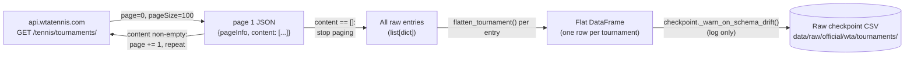

# WTA Tournaments API: Fetch Pipeline

[← Pipelines overview](README.md) · [WTA tournament table](wta-api-tournaments.md) · [Architecture: datasources](../architecture/datasources.md)

## Goal

Get every tournament (all levels, ITF included) that api.wtatennis.com knows
about for a given season, and persist it as an unmodified raw checkpoint —
the same "snapshot first, filter/clean later" pattern as the
[Tennis-Data UK fetch pipeline](tennis-data-uk-fetch.md), applied to a JSON
API instead of an Excel download.

## Overview

| Layer | Module | Job |
|---|---|---|
| Client | `datasources.wta.client.WtaApiClient` | Know the API's endpoint/query params, page through results, flatten each JSON entry to a row. |
| Flattener | `datasources.wta.cleaner.flatten_tournament` | Pull the fields worth keeping out of one raw tournament JSON object. |
| Checkpoint | `datasources.wta.checkpoint` | Persist a season's flattened `DataFrame` to disk unmodified, warn on schema drift. |
| Workflow | `workflows.wta_api.fetch` | Wire client + checkpoint together for one or many years; expose a reload-without-cleaning helper. |
| Script | `scripts/wta_api/call_wta_api.py` | CLI: year(s) → fetch → checkpoint, or `--no-write` for a dry run. |

## TL;DR

`WtaApiClient.get_tournaments(year)` pages through
`GET /tennis/tournaments/?from=<year>-01-01&to=<year>-12-31&page=<n>&pageSize=<n>`
until a page comes back with an empty `content` list, flattening each raw
JSON tournament entry into a row via `flatten_tournament()` along the way.
**The server caps `pageSize` at 100 no matter what's requested** — the
client defaults to exactly that (`page_size: 100` in config) so it isn't
silently wasting a query param on a number the server will just clamp down
anyway. `checkpoint.fetch_and_checkpoint(year)` writes the resulting
`DataFrame` as-is (no renaming, no dtype coercion, no level filtering) to
`data/raw/official/wta/tournaments/wta_api_tournaments_<year>.csv`.
`workflows.wta_api.fetch.fetch_and_checkpoint_year()` / `_years()` wrap that
for one or several years, skipping (not aborting on) a bad year in a batch.

## Stages



## 1. Client: pagination, and the page-size cap that matters

`WtaApiClient` (`datasources/wta/client.py`) talks to a single endpoint,
`GET {base_url}/tennis/tournaments/`, with four query parameters built by
`get_tournaments_page()`:

- **`from`/`to`** — always `f"{year}-01-01"`/`f"{year}-12-31"`; there's no
  way to request a partial year or a cross-year range in one call.
- **`page`** — the page **offset**, zero-indexed, incremented by the caller
  (not the server) on every iteration.
- **`pageSize`** — how many entries to return per page. Defaults to
  `self.page_size` (from `settings.wta_api.page_size`, `100`), but can be
  overridden per call.
- **`excludeLevels`** (optional) — a comma-joined string (e.g.
  `"ITF,WTA 125"`) to filter certain tournament levels out **server-side**;
  `get_tournaments()`/`iter_tournament_entries()` accept a string or an
  iterable of strings and join them.

**The page-size cap is the detail most worth knowing before touching this
client**: the code comment in `WtaApiConfig.page_size` states it was
*verified empirically* that the server clamps `pageSize` to 100 regardless
of what's requested — asking for 500 doesn't get you 500 rows back per page,
it silently gets treated as 100. Pagination still works correctly with a
larger requested value (you'd just make more round trips than necessary to
get the same data), so the config default is set to exactly what the server
actually honors rather than something that looks more generous but wastes a
query param and an extra request or two.

`iter_tournament_entries(year, exclude_levels=None)` is the actual paging
loop:

```python
entries: list[dict[str, Any]] = []
page = 0
while True:
    payload = self.get_tournaments_page(year, page=page, exclude_levels=exclude_levels)
    content = payload.get("content") or []
    if not content:
        break
    entries.extend(content)
    page += 1
return entries
```

The loop's only termination condition is an **empty `content` list** on a
page — not a total-count field from `pageInfo` (the response does include a
`pageInfo` object, but nothing here reads it to know in advance how many
pages to expect). This means a transient API hiccup that returns a
prematurely-empty page would be indistinguishable from genuinely reaching
the end of the season's tournaments — there's no separate "did we actually
get everything" check.

`get_tournaments(year, exclude_levels=None)` is the actual public entry
point: calls `iter_tournament_entries()`, then
`pd.DataFrame(flatten_tournament(entry) for entry in entries)` to produce
one flat row per tournament. Network/HTTP errors from any page are wrapped
in `WtaApiDownloadError`.

One more client-level quirk worth knowing: **TLS verification is disabled
by default** (`verify_ssl: false` in config) — the code comment states the
site's certificate fails verification as of 2026-09, and rather than
silently retry insecurely on a per-request basis if verification ever
failed, the client disables it outright up front and suppresses the
resulting `InsecureRequestWarning` noise (`urllib3.disable_warnings(...)` at
module import time).

## 2. Flattener: `flatten_tournament`

`datasources/wta/cleaner.py`'s `flatten_tournament(entry)` turns one raw
`/tennis/tournaments/` JSON object into a flat dict — this is what actually
determines the raw checkpoint's column set, since the client applies it to
every entry before ever writing anything to disk:

- **`tournament_group_id`** (from `entry["tournamentGroup"]["id"]`) — the
  single most important field this pipeline surfaces. The docstring notes
  it's been *verified empirically* to be a stable, permanent id for a
  tournament's venue/event across years (Indian Wells is `609` in both 2019
  and 2025) — unlike Sackmann's per-season `tourney_id`, which has to be
  parsed and doesn't always recover the permanent tournament id at all (see
  [tournament_linker.md](../scripts/tournament_linker.md)). This is exactly
  why it matters for tournament matching — see the
  [tournament table pipeline](wta-api-tournaments.md) for how it becomes
  `official_tournament_id`.
- **`singles_champion`** — pulled out of the `winners` list by finding the
  first entry with a non-null `singles.player`, defaulting to `None` if
  there's no `winners` list at all (tournament not yet played) or every
  entry's `singles` key is `None` (a doubles-only winners entry).
- Everything else is a fairly direct field pull: `group_name`, `level`,
  `title`, `year`, `start_date`/`end_date`, `surface`, `in_outdoor`, `city`,
  `country`, `singles_draw_size`/`doubles_draw_size`, `prize_money`/
  `prize_money_currency`, and `status` (`"past"`/`"future"`/`"inProgress"`/
  `"live"` — the code comment notes this is especially useful for the
  current season, where most rows haven't been played yet).

No dtype coercion or renaming happens here beyond the flattening itself —
that's deferred entirely to the [tournament table pipeline](wta-api-tournaments.md).

## 3. Checkpoint: write as-is, warn on drift

`checkpoint.fetch_and_checkpoint(year, client=None, raw_dir=None)`
(`datasources/wta/checkpoint.py`) is the only place a downloaded season gets
persisted:

- `client.get_tournaments(year)` — every level, ITF included; there's no
  server-side level exclusion applied at this stage (that's a downstream
  concern per the script's own docstring).
- `_warn_on_schema_drift()` — same pattern as the
  [Tennis-Data UK checkpoint](tennis-data-uk-fetch.md#2-checkpoint-sanity-check-then-write):
  compares the new download's columns against whatever's already at the
  checkpoint path (if anything) and **logs** (doesn't raise) any
  added/removed columns. There's no tour-mismatch check here the way UK has
  one — there's only one tour (WTA) and one endpoint, so that failure mode
  doesn't apply.
- Writes via `df.to_csv(path, index=False)`. `raw_checkpoint_path(year,
  raw_dir)` resolves to `settings.paths.raw / wta_api.raw_dir_name /
  wta_api.tournament_dir_name / wta_api.raw_filename_template.format(year=year)`
  → `data/raw/official/wta/tournaments/wta_api_tournaments_<year>.csv` by
  default.

Re-running a fetch for a year that already has a checkpoint **overwrites
it** — same snapshot-not-log convention as every other raw checkpoint in
this repo.

## 4. Workflow: `workflows/wta_api/fetch.py`

Thin orchestration layer, structurally identical to the
[Tennis-Data UK fetch workflow](tennis-data-uk-fetch.md#3-workflow-multi-year-orchestration):

- `fetch_and_checkpoint_year(year, client=None, raw_dir=None) -> Path` —
  calls `checkpoint.fetch_and_checkpoint()`, logs a
  `"[2026] Wrote N rows to <path>"` line, returns the path.
- `fetch_and_checkpoint_years(years, client=None, raw_dir=None,
  fail_fast=False) -> list[Path]` — loops per year; a failure is logged with
  `logger.exception` (full traceback) and **skipped**, not raised, unless
  `fail_fast=True`.
- `load_raw_year(year, raw_dir=None) -> DataFrame` — reloads an existing raw
  checkpoint via a plain `pd.read_csv` (no dtype restoration step exists for
  this source the way `loader.uk.load_clean_uk_data` restores UK dtypes —
  there's nothing to restore yet since nothing's been typed in the first
  place).

## 5. Script: `scripts/wta_api/call_wta_api.py`

- Positional `years` argument accepts single years and/or `start-end` ranges
  (`parse_years()` — same helper shape used by every other year-based script
  in this repo).
- `--raw-dir` overrides the config-driven output directory.
- `--write`/`--no-write` (an `argparse.BooleanOptionalAction`, default
  `True`) — `--no-write` still calls `client.get_tournaments(year)` and
  prints the row count, so a dry run still exercises the full
  paginate-and-flatten path and reports real numbers, it just skips
  `fetch_and_checkpoint_year()`.
- Iterates years directly in `main()` (not via
  `fetch_and_checkpoint_years()`), so — like `call_tennis_data_uk.py` — a
  bad year raises immediately and aborts the rest of a multi-year run;
  there's no per-year fault isolation at the script layer.

## Configuration

`settings.wta_api` (`config/schemas/wta_api.py`, `configs/config.yaml`):

| Key | Purpose | Default |
|---|---|---|
| `base_url` | API base URL | `https://api.wtatennis.com` |
| `request_timeout_seconds` | Per-request timeout | `30.0` |
| `retry_total` / `retry_backoff_factor` | `urllib3.Retry` tuning | `3` / `0.5` |
| `page_size` | Requested page size — **server clamps to 100 regardless** | `100` |
| `verify_ssl` | TLS verification — disabled due to a known cert issue as of 2026-09 | `false` |
| `raw_dir_name` / `raw_filename_template` | Raw checkpoint location/naming | `official/wta` / `wta_api_tournaments_{year}.csv` |

## Known limitations

- **Pagination termination relies solely on an empty page**, not a
  `pageInfo` total-count check — a transient short/empty page from the API
  would silently look identical to "reached the end of the season."
- **`page_size` above 100 is silently clamped server-side** — there's no
  client-side warning if a caller overrides `page_size` to something larger
  thinking it'll reduce the number of requests; it won't.
- **`verify_ssl=False` is a blanket workaround**, not scoped to the specific
  known certificate problem — any future MITM risk on this connection would
  also go unnoticed.
- **No dtype restoration on reload.** `load_raw_year()` is a plain
  `pd.read_csv` — dates, ints, etc. all come back as generic
  object/int64/float64, unlike `loader.uk.load_clean_uk_data`'s explicit
  dtype-restoring counterpart.
- **`call_wta_api.py` aborts a multi-year run on the first failure** — same
  caveat as `call_tennis_data_uk.py`; there's no `--fail-fast`-style
  opt-out because there's no fault-tolerant path being used to begin with.

## Testing

`tests/sources/wta/test_wta_client.py` covers `flatten_tournament` (including
the no-winners and doubles-only-winner edge cases), the page-request
parameters (`get_tournaments_page`), the empty-content pagination
termination (`iter_tournament_entries`), the `excludeLevels` comma-joining,
and that request errors raise `WtaApiDownloadError`. There is no dedicated
test for `datasources.wta.checkpoint` or `workflows.wta_api.fetch` today.
