# WTA Tournaments API: Tournament Table Pipeline

[← Pipelines overview](README.md) · [WTA API fetch](wta-api-fetch.md) · [Tennis-Data UK tournament table](tennis-data-uk-tournaments.md)

## Goal

Turn api.wtatennis.com's tournament entries into a clean, permanently-keyed
tournament table — the **most authoritative** tournament id source in this
repo, since it's the only one where `official_tournament_id` comes straight
from the WTA's own system rather than being inferred from another source's
numbering. This is why it matters for tournament matching: it's the ground
truth the [cross-source tournament linker](../scripts/tournament_linker.md)
resolves everything else against.

## Overview

| Layer | Module | Job |
|---|---|---|
| Client (reused) | `datasources.wta.WtaApiClient.get_tournaments` | Same paginated fetch as the [fetch pipeline](wta-api-fetch.md) — called live, not from a checkpoint. |
| Clean/type | `handler.wta_api.tournaments.build_wta_api_tournament_table` | Rename `tournament_group_id` → `official_tournament_id`, add `tour`, parse dates, dedupe. |
| Workflow | `workflows.wta_api.tournaments.build_wta_api_tournaments` | Fetch every requested year live, clean, upsert into the shared CSV. |
| Script | `scripts/wta_api/build_wta_api_tournaments.py` | CLI over the workflow. |

## TL;DR

Unlike the Tennis-Data UK and Sackmann tournament tables, this one needs
**no match-level aggregation at all** — the API already returns one entry
per tournament. `build_wta_api_tournaments(years)` calls
`client.get_tournaments(year)` live for each requested year (paginating at
the server-enforced 100-per-page cap — see the
[fetch pipeline](wta-api-fetch.md#1-client-pagination-and-the-page-size-cap-that-matters)
for the offset/page-size mechanics), concatenates every year, and hands the
result to `build_wta_api_tournament_table()`, which renames
`tournament_group_id` to `official_tournament_id`, tags `tour="wta"`, parses
`start_date`/`end_date`, and dedupes/sorts on
`tour`/`year`/`official_tournament_id`. The result is upserted into one
shared CSV — there's no per-tour split (WTA-only, obviously) and no
inconsistency table, since there's nothing to aggregate/disagree across
multiple match rows in the first place.

## Stages

```mermaid
flowchart LR
    A["Requested years"] -->|"WtaApiClient.get_tournaments(year)\n(paginated, live - see fetch pipeline)"| B["Raw flattened DataFrame\nper year"]
    B -->|"pd.concat all years"| C["Combined raw DataFrame"]
    C -->|"build_wta_api_tournament_table()"| D["rename tournament_group_id\n-&gt; official_tournament_id"]
    D --> E["insert tour='wta'"]
    E --> F["parse start_date/end_date"]
    F --> G["drop_duplicates + sort\non tour/year/official_tournament_id"]
    G -->|"upsert_csv()\nkeep='last'"| H[("wta_api_tournaments.csv")]
```

## 1. Input: fetched live, every run

`build_wta_api_tournaments()` (`workflows/wta_api/tournaments.py`) does
**not** read from the raw checkpoint the [fetch pipeline](wta-api-fetch.md)
writes — it calls `client.get_tournaments(year)` directly, per year, live.
A year that returns an empty `DataFrame` is logged as a warning and
skipped, not an error; if **every** requested year comes back empty, it
raises `ValueError`. Every level is included (ITF through Grand Slam) —
there's no `exclude_levels` filtering applied at this stage either;
per the script's own docstring, filtering to main-tour-only is explicitly
left as "a downstream concern," not something this table pre-decides for
every consumer.

## 2. Clean/type: `build_wta_api_tournament_table`

`handler/wta_api/tournaments.py` is deliberately the simplest of the three
tournament-table builders in this repo (contrast with the
[generic aggregator](tennis-data-uk-tournaments.md#2-generic-aggregator-build_tournament_table)
the UK and Sackmann tables share) — its own module docstring calls out why:
this source is *already* one row per tournament, so there's no
match-level `groupby`/mode-aggregation/inconsistency-detection step needed
at all. It just types and renames:

- **`tournament_group_id` → `official_tournament_id`.** This rename is the
  reason this whole table exists: the module docstring spells out that
  `mapper.tournaments.extract_official_tournament_id` has to *infer* this
  same permanent id from Sackmann's `tourney_number` for the vast majority
  of tournaments, and can't recover it at all for the M0xx/Olympics-era
  rows (see that module's own docstring) — whereas this API source hands
  it over directly, no extraction or backfill logic required. That
  asymmetry is exactly why this table, not the Sackmann one, is the
  authoritative id source the [tournament linker](../scripts/tournament_linker.md)
  ultimately resolves everything against.
- **`tour` is inserted as a constant `"wta"` column** (`df.insert(0, "tour",
  "wta")`) — there is no ATP equivalent of this API in the codebase today,
  so this column exists purely for schema parity with the UK/Sackmann
  tournament tables (`CLEAN_TOURNAMENT_KEY_COLUMNS = ["tour", "year",
  "official_tournament_id"]` matches their shape) rather than because WTA
  needs disambiguating from anything else here.
- **`start_date`/`end_date` parsed** via a plain `pd.to_datetime()` — no
  `format=` argument, unlike the UK/Sackmann pipelines' `format="mixed"`/
  `"%Y%m%d"` handling, since the API always returns ISO `YYYY-MM-DD`
  strings (per the client test fixture, e.g. `"2025-03-05"`) with no
  historical format drift to account for.
- **Deduplicated and sorted** on the key columns
  (`drop_duplicates(subset=CLEAN_TOURNAMENT_KEY_COLUMNS)` then
  `sort_values(...)`) — this handles the case where the same tournament
  entry could appear more than once across the concatenated years (e.g. a
  tournament whose `from`/`to` date window is queried twice), but there's
  no `keep="first"`/`"last"` distinction made explicit here since
  `drop_duplicates` defaults to keeping the first occurrence.
- **Column selection**: the final `DataFrame` is restricted to exactly
  `CLEAN_TOURNAMENT_KEY_COLUMNS + CLEAN_TOURNAMENT_ATTRIBUTE_COLUMNS` —
  `group_name`, `level`, `title`, `surface`, `in_outdoor`, `city`,
  `country`, `singles_draw_size`, `doubles_draw_size`, `prize_money`,
  `start_date`, `end_date`, `singles_champion` — dropping anything else
  `flatten_tournament()` produced (there's currently nothing else, but this
  is what would silently drop a newly-added flattened field if one were
  added to the cleaner without also adding it here).

## 3. Persistence: one shared CSV, upserted

`tournament_table_path(clean_dir=None)` resolves to
`settings.paths.clean / wta_api.clean_dir_name / wta_api.tournament_dir_name
/ wta_api.tournament_filename` →
`data/clean/wta_api/tournaments/wta_api_tournaments.csv` by default — a
single file, not one per tour (there's only one tour here) and not
partitioned by year on disk.

`build_wta_api_tournaments()` upserts via the same shared
`workflows._csv_upsert.upsert_csv()` helper the UK tournament table uses
(see [that doc's persistence section](tennis-data-uk-tournaments.md#4-persistence-two-upserted-csvs-never-an-overwrite)
for the mechanics), keyed on `CLEAN_TOURNAMENT_KEY_COLUMNS`
(`tour`/`year`/`official_tournament_id`), `keep="last"` (freshly fetched
rows win), with `start_date`/`end_date` parsed on reload. Returns
`(table_path, tournament_count)` — no inconsistency count, since there's no
inconsistency table for this source (nothing to disagree across, per §2).

## 4. Script: `scripts/wta_api/build_wta_api_tournaments.py`

- Positional `years` (single years and/or ranges, `parse_years()` — same
  helper as every other year-based script).
- `--clean-dir` overrides the config-driven output directory.
- No `--tour` flag (WTA-only, nothing to select), no `--fail-fast`
  (the whole multi-year fetch happens in one function call with no
  per-year isolation — a bad year is skipped with a warning inside
  `build_wta_api_tournaments()` itself, not something the script chooses).
- Always exits `0` on success, `2` only on a malformed year argument.

## Configuration

`settings.wta_api` (beyond what the
[fetch pipeline](wta-api-fetch.md#configuration) already covers):

| Key | Purpose | Default |
|---|---|---|
| `clean_dir_name` / `tournament_dir_name` / `tournament_filename` | Tournament-table output location/naming | `wta_api` / `tournaments` / `wta_api_tournaments.csv` |

## Known limitations

- **Fully live, every run** — same as the fetch pipeline, but doubly so
  here since this workflow doesn't even read the raw checkpoint; a
  multi-year rebuild always re-pages the whole API rather than reusing a
  local snapshot.
- **No inconsistency detection** — reasonable given the source is already
  one row per tournament, but it also means there's no automatic flag if
  the API itself ever returns internally contradictory data for the same
  `official_tournament_id` across two fetches (e.g. a corrected surface
  after a rain delay) — `keep="last"` just silently replaces the old row.
- **`drop_duplicates` default (`keep="first"`) predates the
  concat-then-dedupe step**, so if the same tournament ever appeared twice
  in one combined fetch with genuinely different values (unlikely, but not
  structurally prevented), the *first* occurrence wins silently rather than
  raising the way the UK pipeline's inconsistency check would.

## Testing

Covered indirectly via `tests/sources/wta/test_wta_client.py` (the
underlying `get_tournaments`/`flatten_tournament` this workflow calls). There
is no dedicated test for `handler.wta_api.tournaments.build_wta_api_tournament_table`
or `workflows.wta_api.tournaments.build_wta_api_tournaments` today.
