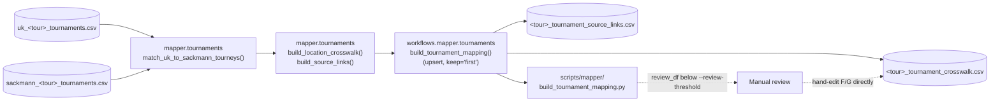

# Tournament Linker: Cross-Source Tournament Id Mapping

[← Scripts overview](README.md) · [Architecture overview](../architecture/README.md)

> **Superseded by [docs/pipelines/tournament-matching.md](../pipelines/tournament-matching.md).**
> This doc predates the WTA-tournaments-API backfill step and the
> `manual_matches` override table (both now part of the pipeline) and is
> kept only for historical reference - prefer the linked doc.

This documents the `mapper` → `workflows.mapper` → `scripts/mapper` chain
that links Tennis-Data UK tournaments to Sackmann tournaments and resolves
both to the permanent ATP tournament id used on atptour.com. It grew out of
manual exploration in
[`notebooks/dev/data-linking/sackmann-uk-tourney-link-explorer.ipynb`](../../notebooks/dev/data-linking/sackmann-uk-tourney-link-explorer.ipynb),
which is still a good place to inspect a single tour/year interactively -
the production path below is a modularized, tested version of that same
logic.

## Why this exists

- Tennis-Data UK's `uk_tournament_id` resets 1-60 every season and isn't
  globally unique, so it can't be used to identify a tournament across
  years or sources.
- Sackmann's `tourney_id` ("{year}-{tourney_number}") embeds the permanent
  ATP tournament id in `tourney_number` for the vast majority of rows (e.g.
  `2025-0375` is Montpellier, ATP id 375) - but neither Tennis-Data UK nor
  Sackmann has that id directly, and there's no shared key between the two
  sources to join on.
- Matching therefore has to be done by fuzzy name/date/surface comparison,
  once per tour/year, and the result is cached so it never needs to be
  redone for a tournament already seen.

## Stages



### 1. Inputs

`workflows.mapper.tournaments.build_tournament_mapping(tour, year)` reads
both tournament-summary tables for the requested tour/year - it does not
fetch or clean anything itself, so both must already exist:

- `workflows.uk.tournaments.tournament_table_path()` →
  `data/clean/uk/<tour>/tournaments/uk_<tour>_tournaments.csv`
  (built by `scripts/uk/build_uk_tournaments.py`).
- `workflows.sackmann.tournaments.tournament_table_path()` →
  `data/clean/sackmann/<tour>/tournaments/sackmann_<tour>_tournaments.csv`
  (built by `scripts/sackmann/build_sackmann_tournaments.py`, with Davis Cup
  rows - `tourney_level == "D"` - excluded before matching).

A year missing either table raises `FileNotFoundError`; the script (see
below) catches this per-year and skips with a warning rather than aborting
a multi-year run.

### 2. Matching (`mapper.tournaments.match_uk_to_sackmann_tourneys`)

Pure function, no I/O. For every UK/Sackmann pair in the requested year it
scores:

- **Name similarity** (`difflib.SequenceMatcher`, 50% weight) - checked
  against both the UK sponsor name (e.g. "BMW Open") and the UK host-city
  `location` (e.g. "Munich"), since Sackmann's `tournament_name` is usually
  the host city.
- **Date proximity** (`date_score`, 40% weight) - 1.0 for the same start
  date, decaying to 0.0 at `MAX_DATE_DIFF_DAYS` (10) apart.
- **Surface match** (10% weight).

Candidates are sorted by score and greedily assigned to the best-scoring
unique pair first; anything below `MIN_MATCH_SCORE` (0.5, overridable via
`settings.mapping.min_match_score`) or already claimed is skipped. Leftover
UK or Sackmann tournaments are kept unmatched (blank id on the other side)
rather than forced into a wrong pair.

Result (`TournamentMatchResult`):

- `link_df` - the persisted shape: `year`, `uk_source_event_key`,
  `sackmann_tourney_id`, `official_tournament_id` (extracted from the Sackmann id
  via `extract_official_tournament_id`; blank for the Olympics/`M0xx`-era rows
  where Sackmann's numbering isn't the permanent id - see the function's
  docstring). **`uk_tournament_id` is deliberately excluded** - unreliable
  across years, see "Why this exists" above.
- `review_df` - `score`/`location`/`uk_name`/`sackmann_name` for every
  matched pair, weakest first. Not persisted - for eyeballing only.

### 3. Crosswalk + source links (`mapper.tournaments`)

- `build_location_crosswalk(link_df, df_uk)` builds a growable
  `location_key -> official_tournament_id` table. A UK tournament's host city is
  stable across years, so once matched here it never needs fuzzy-matching
  again. A location isn't always unique to one tournament (Paris hosts both
  Roland Garros and the Paris Masters) - detected automatically via a
  nunique-per-location check, and only ambiguous locations fall back to a
  composite `location + tournament_name` key.
- `build_source_links(link_df)` builds a long/tidy table: one row per
  `(source, year, source_tournament_id)` pointing at an `official_tournament_id`.
  Onboarding a new data source later never needs a schema change here -
  just more rows tagged with that source's name.

### 4. Persistence (`workflows.mapper.tournaments.build_tournament_mapping`)

Both tables are upserted via `workflows._csv_upsert.upsert_csv(...,
keep="first")` into `data/mapping/tournaments/`:

- `crosswalk_path(tour)` → `<tour>_tournament_crosswalk.csv`
  (key: `location_key`).
- `source_links_path(tour)` → `<tour>_tournament_source_links.csv`
  (key: `source` + `year` + `source_tournament_id`).

`keep="first"` is the important part of the review/commit model: **rows
already on disk always win over freshly computed ones.** If you hand-correct
a row directly in either CSV, rerunning the script for that (or any other)
year will never overwrite it - only genuinely new rows get added.

### 5. Script (`scripts/mapper/build_tournament_mapping.py`)

```bash
python scripts/mapper/build_tournament_mapping.py --tour atp 2025
python scripts/mapper/build_tournament_mapping.py --tour atp 2010-2025
python scripts/mapper/build_tournament_mapping.py --tour wta 2024 2025 --review-threshold 0.95
```

Per year, it calls `build_tournament_mapping()` and logs a summary (matched
count vs. each side's total). Any matched pair scoring below
`--review-threshold` (default 0.9) is printed for manual review - nothing is
auto-rejected, but a low score is worth checking (and hand-correcting in the
crosswalk/source-links CSVs if wrong) before relying on it downstream.
Useful flags: `--uk-clean-dir` / `--sackmann-clean-dir` / `--mapping-dir` to
point at scratch directories (e.g. for testing), `--verbose` for debug
logging.

## Review → commit → override workflow

1. Run the script for a tour/year.
2. Read the logged weak-match warnings (or open `<tour>_tournament_crosswalk.csv`
   / `<tour>_tournament_source_links.csv` directly) and eyeball anything
   that looks wrong.
3. If a match is wrong, edit the row directly in the CSV (or delete it to
   force re-matching next run for that location/source id).
4. Rerun any time (new years, or the same year again) - your edits are
   never overwritten, only new rows are added.

## Configuration

`settings.mapping` (see `config/schemas.py::MappingConfig`,
`configs/config.yaml`): `tournament_dir_name`, `crosswalk_filename_template`,
`source_links_filename_template`, `min_match_score`. Output directory root
is `settings.paths.mapping` (`data/mapping/` by default, override via the
`TENNIS_DATA_PIPELINE_MAPPING_DIR` env var).

## Known limitations

- A location can host more than one tournament in the same year beyond
  Paris (e.g. London 2000-2019, Adelaide 2022-2023) - the composite-key
  fallback handles this correctly *as long as* the ambiguity is present in
  the year(s) actually processed. A location that's only ever hosted one
  event in the years run so far won't be flagged even if it's ambiguous in
  a year not yet processed.
- Conversely, the same permanent id can appear under different locations
  across years (e.g. the European Open: Antwerp in 2024, Brussels in 2025)
  - this is correct/expected, not a bug, since the crosswalk key is
  `location`, not `official_tournament_id`.
- Matching is per tour/year; there's no cross-year identity check beyond
  the `official_tournament_id` extracted from Sackmann's `tourney_number`.

## Testing

`tests/mapper/test_mapper_tournaments.py` covers `normalize_tournament_name`,
`date_score`, `extract_official_tournament_id`, the matching/unmatched-row logic,
the Paris-style ambiguous-location crosswalk case, and `build_source_links`.
