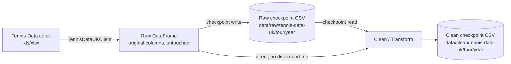

# Tennis-Data.co.uk Pipeline Plan

Status: draft / not yet implemented. This document defines the target
architecture; nothing in this file has been built yet unless noted.

## 1. Motivation

While fixing the recent Tennis-Data.co.uk URL change and a stray extra
column (`BFEW`/`BFEL`), we found the ATP/WTA handling for this source had
grown into two divergent, partially-broken pipelines:

- `datasources/tennis_data_uk/` (client + `schema.py`/`cleaning.py`) - used
  for live/incremental downloads. Keeps near-original column names
  (`winner_Name`, `winner_B365_odds`). Covers every historical bookmaker.
- `handler/uk/cleaner/` (`atp_cols.py` + `atp.py`) - used to batch-clean the
  one-time historical CSV snapshot in `data/raw/tennis-data-uk/2024-10/` into
  `data/clean/tennis-data-uk/atp/*.csv`. Produces the actual "nice" schema
  (snake_case, `R32`/`QF`/`SF`/`F` round codes, boolean `is_outdoor`,
  generated match/event keys, data-quality validation). Had a broken import
  (`from ....cleaner.uk import atp_cols`, now fixed) that meant it could not
  actually run, so the committed clean CSVs were stale relative to the
  current code (e.g. `is_outdoor` in those files is the string
  `"outdoor"`/`"indoor"`, not the boolean the current code produces). WTA has
  no equivalent at all.
- The `data/raw/tennis-data-uk/2024-10/wta/wta_singles_results_2024.csv`
  snapshot is mislabeled: it actually contains 2024 ATP match data.

The old ATP clean output has been moved to
`data/archive/tennis-data-uk/atp-v1-2024-10/` (see its `README.md`). This
document is the plan for what replaces it.

## 2. Goals

1. One pipeline, two tours: ATP and WTA go through the same code path and
   land in the same canonical schema (same column names, same dtypes, same
   categorical vocabularies wherever the underlying concept is shared).
2. One cleaning implementation, two ways to feed it:
   - Fresh data pulled directly from tennis-data.co.uk (daily/backfill use).
   - A previously-saved raw checkpoint CSV (reprocessing/bug-fix use, no
     network access required).
3. A raw checkpoint stage in between so re-cleaning (e.g. after fixing a bug
   in the cleaning code) never requires re-downloading, and downloading never
   silently discards the source-original data.
4. A documented, auditable place to add the "known data error" fixes we
   already do in `notebooks/cleaning/uk-data-cleaning.ipynb` /
   `clean_uk_atp_data.py` (bad tournament ids, wrong results, typo'd
   categories, impossible odds) - and that we expect to keep finding more of
   as we go further back in the historical data.

## 3. Pipeline stages



### Stage 1: Extract

`TennisDataUKClient.load_year(year, tour)` (already exists) downloads one
season's xls/xlsx and returns a `DataFrame` with the source's original
column names, completely unmodified - no renaming, no dtype coercion beyond
what `pandas.read_excel` does natively.

### Stage 2: Raw checkpoint

A raw `DataFrame` (from Stage 1, or from re-reading a checkpoint file) is
"the same thing" either way - byte-for-byte the source's own columns. Saving
it is just `df.to_csv(path, index=False)`.

Proposed layout (replaces the one-off `2024-10` dated snapshot folder for
all *future* writes; that folder stays as the historical starting point):

```
data/raw/tennis-data-uk/
  atp/atp_singles_results_<year>.csv
  wta/wta_singles_results_<year>.csv
```

Re-running the download for a given year overwrites that year's file. This
is safe because it's a pure checkpoint of the source - nothing downstream
depends on its git history being append-only, and the clean stage's
validation will flag anything that looks wrong after a refresh.

**Sanity-check the checkpoint before it's trusted.** Both real bugs found
while writing this plan - the `wta_singles_results_2024.csv` snapshot
actually containing ATP data, and the ATP clean pipeline silently running
against a stale schema - are exactly what a cheap check right after
download/checkpoint-write would catch. Before (or immediately after) writing
the Stage-2 checkpoint:

- Confirm the tour-identifying column matches the requested tour (a WTA
  pull must have a `WTA` column, not `ATP`, and vice versa).
- Compare the new file's column set against the previous checkpoint for
  that tour/year (if one exists) and log a warning listing any
  added/removed columns - this is how we'd have noticed `BFEW`/`BFEL`
  automatically instead of by manually diffing sample files.

This check belongs at Stage 2, before Stage 3 ever sees the data - it's
about "is this the file we think it is", not about match-level data quality
(that's Stage 3's job).

### Stage 3: Clean / Transform

A single function per tour (or one function parameterized by tour, see
open questions), taking a raw `DataFrame` and returning the canonical clean
`DataFrame`. Internally:

1. **Load & coerce base dtypes** - parse `Date`, coerce rank/points/set/odds
   columns to numeric, categoricals for the raw string columns. (Already
   exists per-tour as `load_dirty_uk_atp_data`; needs a WTA counterpart.)
2. **Apply known-issue fixes** - see &sect;5.
3. **Validate structural invariants** - tournament-id consistency, no reused
   ids across different tournaments, expected surfaces/rounds, odds &ge; 1,
   completed matches have plausible set scores. (Tour-agnostic already:
   `handler/uk/validatior/tournaments.py`.)
4. **Rename & normalize to the canonical schema** - see &sect;4.
5. **Add provenance/key columns** - `source`, `tour`, `source_event_key`,
   `source_match_key`.

This function must not care whether its input came from a live download or
a checkpoint file - that's the whole point of separating Stage 1/2 from
Stage 3.

### Stage 4: Clean checkpoint

```
data/clean/tennis-data-uk/
  atp/uk_atp_singles_matches_<year>.csv
  wta/uk_wta_singles_matches_<year>.csv
  analysis/tennis_data_uk_quality_report.csv   # one shared report, "tour" column added
```

Because the schema is now identical across tours, a combined loader can
`pd.concat` both tours' files trivially (see `loader/uk.py`, which already
does this per-year for ATP and just needs a `tour` argument).

**Watch the report's row key.** The current `update_quality_report` dedups
on an index like `Metric_<year>`. With both tours writing into one shared
report, ATP's and WTA's `2024` rows would collide and silently overwrite
each other. The shared report must key on `(tour, year)` - e.g. index
`Metric_<tour>_<year>`, or dedup on an explicit `[tour, year]` pair instead
of a single formatted string.

### Two entry points into Stage 3

- `clean_from_checkpoint(project_dir, tour, year)` - reads the Stage-2 CSV
  from disk. Used for reprocessing/backfill and for the historical import.
- `clean_from_live(tour, year, client=None)` - calls
  `TennisDataUKClient` directly, in memory. Used for daily refresh.

Recommended daily-refresh flow: `clean_from_live` should still *write* the
Stage-2 raw checkpoint before cleaning (download once, persist raw, then
clean), so a fresh pull always leaves an audit trail and a byte-for-byte
input a bug fix can be replayed against later without hitting the network
again.

## 4. Canonical schema (shared by ATP and WTA)

Column *names and dtypes* are identical for both tours. Where a value
concept is genuinely shared (surface, indoor/outdoor, match status, round)
the *categorical values* are unified too. Where it isn't (ATP `Series` vs.
WTA `Tier` describe different tournament-level systems), the column exists
in both with the same name but keeps tour-native values - see &sect;4.2.

| Column | Type | Notes |
|---|---|---|
| `source` | category | always `"tennis_data_uk"` |
| `tour` | category | `"atp"` / `"wta"` |
| `year` | Int64 | season |
| `uk_tournament_id` | Int64 | from `ATP`/`WTA` source column |
| `tournament_name` | string | |
| `location` | string | |
| `match_date` | datetime64 | |
| `series` | category | tour-native vocabulary, see &sect;4.2 |
| `is_outdoor` | boolean | from `Court` |
| `surface` | category | shared vocabulary: `hard`/`clay`/`grass`/`carpet` |
| `round` | category | shared vocabulary: `R128`/`R64`/`R32`/`R16`/`QF`/`SF`/`F`/`RR`/`BR` |
| `best_of` | Int64 | `3` or `5` |
| `winner_name` / `loser_name` | string | |
| `winner_rank` / `loser_rank` | Int64 | |
| `winner_rank_points` / `loser_rank_points` | Int64 | |
| `winner_sets` / `loser_sets` | Int64 | |
| `winner_set_{1..5}_games` / `loser_set_{1..5}_games` | Int64 | **WTA always has `set_4`/`set_5` present but all-NaN** (best-of-3 only), so the column set matches ATP exactly |
| `match_status` | category | shared vocabulary: `completed`/`retired`/`walkover`/`cancelled`/`disqualified`/`awarded` |
| `odds_b365_winner` / `odds_b365_loser` | float64 | |
| `odds_pinnacle_winner` / `odds_pinnacle_loser` | float64 | |
| `odds_max_winner` / `odds_max_loser` | float64 | |
| `odds_avg_winner` / `odds_avg_loser` | float64 | |
| `source_event_key` | string | `<year>_<uk_tournament_id>_<location-slug>_<tournament-slug>` |
| `source_match_key` | string | `<source_event_key>_<match_date>_<winner-slug>_<loser-slug>` |

Historical-only bookmakers (`CB`, `EX`, `LB`, `GB`, `IW`, `SB`, `SJ`, `B&W`,
`BFE`) are intentionally **not** part of the clean schema - they come and go
across seasons and bookmakers, and B365/Pinnacle/Max/Avg already give
consistent coverage across the whole date range. They're still fully
captured at the raw-checkpoint stage (Stage 2), so nothing is lost if a
future need for them comes up.

### 4.1 Round codes

Bracket position is inferred by counting backward from the quarterfinals
(draw sizes vary too much for a fixed "1st Round" &rarr; code mapping), plus
static entries for named rounds:

| Raw `Round` | Canonical `round` |
|---|---|
| `Quarterfinals` | `QF` |
| `Semifinals` | `SF` |
| `The Final` | `F` |
| `Round Robin` | `RR` |
| `Third Place` (WTA only, e.g. WTA Finals round-robin ties) | `BR` |
| `1st Round`/`2nd Round`/... | `R16`/`R32`/`R64`/`R128` (counted backward from QF per tournament) |

### 4.2 `series` is intentionally tour-native, not unified

ATP's `Series` (`Grand Slam`, `Masters 1000`, `ATP500`, `ATP250`, `Tour
Finals`, ...) and WTA's `Tier` (`Grand Slam`, `WTA1000`, `Premier`,
`International`, `Tier 1..4`, ...) both describe "how big is this
tournament", but they're different classification systems that changed
over time within each tour, and a forced ATP&harr;WTA mapping (e.g. is
`ATP500` really equivalent to `WTA500`, or to `Premier`?) would be a
judgment call baked silently into the data. Decision: keep `series` as one
column present in both tours' output (so `df.groupby(["tour", "series"])`
etc. always works), but don't force shared values.

If a model later needs a cross-tour "tournament tier" feature, that should
be a separate, explicit, documented derived column (e.g.
`tournament_tier_normalized`) built on top of this table - not baked into
the base clean schema.

## 5. Known-issue fix registry

Today `clean_uk_atp_data.py` has this as a growing chain of
`if year == 2019: ...` blocks. As we go further back in the historical data
we already expect to find more of these (per this conversation), so this
should become a small, explicit, append-only registry instead of more
`if` branches. To be clear about what this buys us: the registry doesn't
make fixes declarative data - `match`/`apply` are still plain code - but it
replaces a scattered `if year == ...` chain with one append-only list that's
easy to scan, and it forces every fix to self-verify it still applies. e.g.:

```python
@dataclass(frozen=True)
class MatchFix:
    tour: Tour
    year: int
    description: str  # human-readable, one line
    source_url: str | None  # e.g. a Wikipedia result page backing the fix
    match: Callable[[pd.DataFrame], pd.Series]  # boolean mask
    apply: Callable[
        [pd.DataFrame, pd.Series], None
    ]  # mutates df in place for the matched rows


def _fix_metz_final_2019(df: pd.DataFrame, mask: pd.Series) -> None:
    df.loc[mask, ["W1", "L1", "W2", "L2", "W3", "L3"]] = [6, 7, 7, 6, 6, 3]
    df.loc[mask, ["Wsets", "Lsets"]] = [2, 1]


KNOWN_FIXES: list[MatchFix] = [
    MatchFix(
        tour=Tour.ATP,
        year=2019,
        description="Metz final (Tsonga d. Bedene): corrupted set-2 score, missing set 3",
        source_url="https://en.wikipedia.org/wiki/2019_Moselle_Open",
        match=lambda df: (
            (df["ATP"] == 53)
            & (df["Winner"] == "Tsonga J.W.")
            & (df["Loser"] == "Bedene A.")
            & (df["Date"] == "2019-09-22")
        ),
        apply=_fix_metz_final_2019,
    ),
    ...,
]
```

Every fix must assert it matched exactly one row (like the current
`_assert_single_match` helper) - a fix that silently matches zero rows after
a future re-scrape or column rename is a bug we want to hear about
immediately, not a fix that quietly stops applying.

This registry is deliberately **one of two separate mechanisms**, not a
unified one: `MatchFix` is for single-row, hand-verified corrections. Bulk
category-level typos (a whole mislabeled value across many rows) don't fit
that shape - they get their own, simpler value-remap table instead, e.g. the
WTA issues already found:

| Tour | Field | Bad value | Fix | Occurrences |
|---|---|---|---|---|
| WTA | `Tier` | `WTA251`..`WTA276` | &rarr; `WTA250` (Excel drag-fill artifact) | 1 each, 2007 |
| WTA | `Comment` | `Walkoer` | &rarr; `Walkover` | 1, 2007 |
| WTA | `Surface` | `Greenset` | &rarr; `Hard` (Greenset is a hard-court brand) | 31, 2007 (Sunfeast Open) |
| WTA | `Best of` | `5` | &rarr; `3` (WTA singles is always best-of-3) | 1, 2007 (Pacific Life Open) |

## 6. Directory layout after this change

```
data/
  raw/
    tennis-data-uk/
      atp/atp_singles_results_<year>.csv        # Stage 2 checkpoint (new convention)
      wta/wta_singles_results_<year>.csv         # Stage 2 checkpoint (new convention)
      2024-10/atp/...                            # original historical import, left as-is
      2024-10/wta/...                            # original historical import; 2024 file is
                                                  # known-bad (contains ATP data) and needs
                                                  # re-fetching before first use
  clean/
    tennis-data-uk/
      atp/uk_atp_singles_matches_<year>.csv       # Stage 4 checkpoint
      wta/uk_wta_singles_matches_<year>.csv       # Stage 4 checkpoint
      analysis/tennis_data_uk_quality_report.csv
  archive/
    tennis-data-uk/
      atp-v1-2024-10/...                          # superseded, kept for reference only
```

## 7. Rollout plan

1. Fix the corrupted `wta_singles_results_2024.csv` raw snapshot (re-download
   from tennis-data.co.uk; requires network access this sandbox doesn't have
   - do this from a machine that can reach the site).
2. Add the Stage-2 raw-checkpoint sanity check (tour-column check +
   column-set diff against the previous checkpoint, &sect;3) so a mismatch like
   #1 or a schema change like `BFEW`/`BFEL` is caught automatically next time,
   not found by hand.
3. Build the shared cleaner:
   - Factor the tour-agnostic pieces of `atp_cols.py` (`ROUND_MAP`,
     `SURFACE_MAP`, `COURT_MAP`, bracket-counting constants,
     `EXPECTED_SURFACES`) into a shared module; keep the small tour-specific
     pieces (`SERIES_MAP`, source-column names, WTA's extra typo fixes) in
     `atp_cols.py`/`wta_cols.py`.
   - Finish `wta_cols.py` (drafted) and add `wta.py` mirroring `atp.py`.
   - Move the known-issue fixes into the `MatchFix` registry + typo-remap
     table from &sect;5, and fix the quality-report `(tour, year)` key from &sect;3.
4. Add test coverage for `handler/uk` (currently zero): the shared
   round/surface/status mapping, the tournament-consistency validators, and
   one test per `KNOWN_FIXES` entry asserting it still matches exactly one
   row. This is the area that produced two unnoticed bugs (the broken import,
   the mislabeled WTA file) with no tests to catch either.
5. Add the Stage-1/2 split: a small "fetch and checkpoint" step usable both
   standalone (`scripts/uk/` daily job) and as a pre-step inside the clean
   scripts.
6. Regenerate the ATP clean CSVs with the fixed code (this will change
   `is_outdoor` from string to boolean and pick up the current schema - a
   real, expected diff against the archived v1 output).
7. Run the WTA cleaner for 2007-2026 once the raw checkpoint is fixed.
8. Point `loader/uk.py` at the new layout and add a `tour` parameter so
   ATP+WTA can be loaded/concatenated together.
9. Retire (or explicitly repurpose) `datasources/tennis_data_uk/cleaning.py`'s
   near-original schema once the unified cleaner covers the live-refresh case
   too, so there's only one clean schema in the codebase.

## 8. Open questions

- Per-tour clean files (current convention) vs. one combined
  `uk_singles_matches_<year>.csv` with a `tour` column, now that the schema
  is identical either way? (Leaning: keep per-tour files - smaller diffs,
  matches existing convention - and rely on the loader to concat.)
- Should the Stage-2 raw checkpoint fully replace
  `datasources/tennis_data_uk/client.py`'s in-memory-only download, or should
  the client itself grow an optional "persist raw checkpoint" flag?
- Do we want a `tournament_tier_normalized` cross-tour column at all (&sect;4.2),
  or leave that entirely to downstream modeling code?
